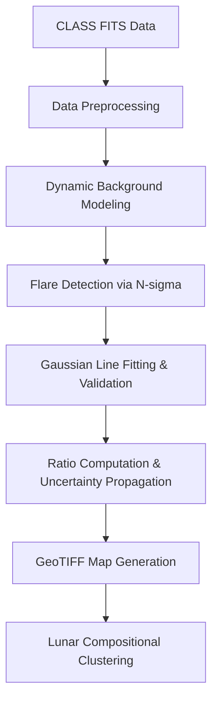
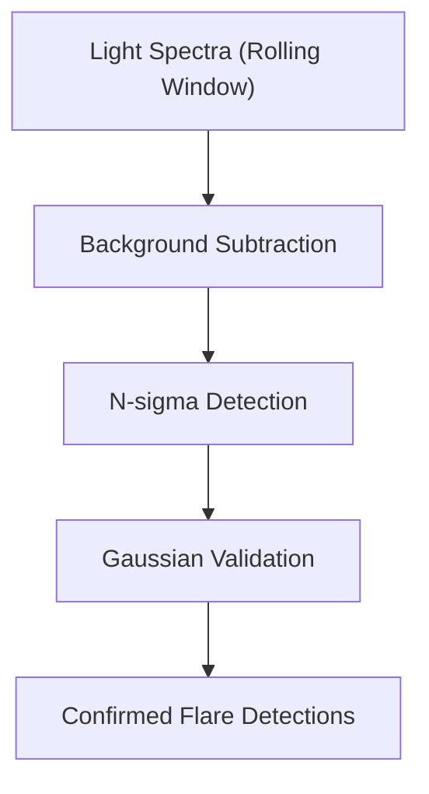

# ISRO – Lunar Elemental Mapping from Chandrayaan-2 CLASS Spectral Data

## Source – [IIT Bombay’s Inter-IIT Tech Meet 13.0 Submission for ISRO’s Problem Statement](https://drive.google.com/file/d/1cQtfmUacMCrh7rRPJjx2Kv5aMGeDeClx/view?usp=sharing)

---

## Table of Contents

1. [Problem Statement](#problem-statement)
2. [Scientific Background](#scientific-background)
3. [Solution Overview](#solution-overview)
4. [Detection Pipeline](#detection-pipeline)

   * [Data Preprocessing](#data-preprocessing)
   * [Dynamic Background Modeling](#dynamic-background-modeling)
   * [Solar Flare Detection – N-sigma Criterion](#solar-flare-detection--n-sigma-criterion)
   * [Spectral Line Fitting](#spectral-line-fitting)
   * [Uncertainty Propagation](#uncertainty-propagation)
5. [Mapping and Ratio Analysis](#mapping-and-ratio-analysis)
6. [Lunar Composition Classification](#lunar-composition-classification)
7. [Results](#results)
8. [Challenges & Lessons](#challenges--lessons)
9. [Future Work](#future-work)
10. [References](#references)

---

## Problem Statement

Develop a **fully automated pipeline** using **CLASS (Chandrayaan-2 Large Area Soft X-ray Spectrometer)** data to:

* Detect **solar flare-induced X-ray fluorescence (XRF)** events
* Identify and fit **elemental line spectra** (Mg, Al, Si, Ca, Fe, etc.)
* Compute **elemental ratios** and their uncertainties
* Generate **dynamic lunar compositional maps**

The system must support **continuous updates** as new data arrives.

---

## Scientific Background

* **[X-ray fluorescence (XRF)](https://doi.org/10.1016/j.sab.2004.03.014)** identifies elements from characteristic emission lines caused by solar excitation.
* The **CLASS** instrument observes soft X-ray bands (0.5–10.8 keV).
* Ratios like **Al/Si**, **Fe/Si**, and **Mg/Si** reveal **highland–mare dichotomy** and **South Pole–Aitken basin** compositions.
* The approach removes dependence on modeled solar spectra for **unbiased abundance mapping**.

---

## Solution Overview



**Highlights**

* Phase-dependent background modeling
* Adaptive **N-sigma** flare detection
* Rolling-window binning for **super-resolution**
* Gaussian fitting via [`scipy.curve_fit`](https://docs.scipy.org/doc/scipy/reference/generated/scipy.optimize.curve_fit.html)
* Uncertainty-aware **GeoTIFF** mapping

---

## Detection Pipeline

### Data Preprocessing

* Split spectra by solar angle (`SOLARANG < 90°` for light, `> 90°` for dark).
* Energy computed as:

  ```text
  E = channel_number × 13.5 eV
  ```
* Each FITS file updated with time, angle, and position metadata.

---

### Dynamic Background Modeling

* “Dark” spectra often show **Aluminum contamination** due to partial exposure.

* Constructed **phase-wise yearly background models** (Full, New, First, Third quarter):

  ```math
  B_P = \text{mean of all dark spectra in phase } P
  ```

* This compensates for **geotail** and **phase-dependent variations**.

---

### Solar Flare Detection – N-sigma Criterion

Replaced fixed 5-σ threshold with a **dynamic adaptive N-sigma** detection ([Sharma et al., 2021](https://ui.adsabs.harvard.edu/abs/2021JApA...42...73S/abstract)):

```math
F_{L,T}(t) \geq \min(5,\ \min(\text{med} + 5\sigma)) \times \sigma_{B_P}
```

Where

* (F_{L,T}(t)) → flux in element L line window (T \pm 0.125,\text{keV})
* (\sigma_{B_P}) → background std for lunar phase P



The **rolling window (8 s)** increases spatial resolution through overlapping averaging.

---

### Spectral Line Fitting

Modeled each detected line using **[Astropy Specutils](https://specutils.readthedocs.io/)** or `scipy.curve_fit`:

```math
S(E) = C(E) + \sum_i A_i \exp\!\left[-\frac{(E - E_i)^2}{2\sigma_i^2}\right]
```

* Verified by synthetic injection–recovery experiments.
* Oxygen line subtracted before **Fe L-line** fitting.
* Covariance matrices validated through χ² tests.

---

### Uncertainty Propagation

Combined **Poisson photon noise** and **fit covariance**:

```math
\sigma_{L_t} = \sqrt{\frac{L_t}{N_L} + \frac{B}{N_B}}
```

For elemental ratios:

```math
R_M^L = \frac{A_M \sigma_M}{A_L \sigma_L}
```

Uncertainty in ratio:

```math
\Delta R_M^L = R_M^L
\sqrt{
\left(\frac{\Delta A_M}{A_M}\right)^2 +
\left(\frac{\Delta\sigma_M}{\sigma_M}\right)^2 +
\left(\frac{\Delta A_L}{A_L}\right)^2 +
\left(\frac{\Delta\sigma_L}{\sigma_L}\right)^2
}
```

---

## Mapping and Ratio Analysis

* Used **[Rasterio](https://rasterio.readthedocs.io/en/latest/)** and **[Shapely](https://shapely.readthedocs.io/en/stable/)** for geospatial rasterization.
* Generated multi-band **GeoTIFF**:

  * **Band 1:** ratio value
  * **Band 2:** propagated uncertainty

Weighted averaging for overlapping orbits:

```math
\bar{R}_M^L =
\frac{\sum_i R_{M,i}^L / \Delta_i^2}{\sum_i 1 / \Delta_i^2},
\qquad
\Delta_{\bar{R}_M^L} =
\frac{1}{\sqrt{\sum_i 1 / \Delta_i^2}}
```


---

## Lunar Composition Classification

Applied **[Gaussian Mixture Models (GMMs)](https://scikit-learn.org/stable/modules/mixture.html)** on ((R_{Al}^{Si}, R_{Mg}^{Si}, R_{Fe}^{Si})) to identify compositional clusters.

| Region        | Characteristic Ratio     | Geological Context                    |
| ------------- | ------------------------ | ------------------------------------- |
| **Highlands** | High Al/Si               | Plagioclase-rich ferroan anorthosites |
| **Maria**     | High Fe/Si               | Basaltic flows (Fe, Ti-rich)          |
| **SPA Basin** | Moderate Al/Si, high Mg# | Deep crust/mantle exposure            |

**Magnesium Number (Mg#)** analog:

```math
Mg\# = \frac{R_{Mg}^{Si}}{R_{Mg}^{Si} + R_{Fe}^{Si}}
```

Triple-component GMM produced spatial clusters aligning with known **selenological units**.

---

## Results

* Generated global maps for **R₍Al/Si₎**, **R₍Fe/Si₎**, and **R₍Mg/Si₎** (96 s bin).
* Clear separation of **mare**, **highland**, and **SPA Basin** regions.
* Histograms reproduce **bimodal Al/Si** and **monomodal Mg/Si** patterns.
* Adaptive N-sigma detection increased valid flare detections up to ×10 for Fe lines.

---

## Challenges & Lessons

* **Aluminum contamination** from partial occultation required phase modeling.
* **Fe L–O overlap** mitigated via oxygen subtraction.
* Dataset ≈ 500 GB → runtime ≈ 5 hours with multiprocessing (6 GB RAM/year).
* **Ca** and **Ti** lines needed strong flares → limited coverage.

---

## Future Work

* Train **neural-network classifiers** using Apollo/Luna ground truth.
* Enable **real-time incremental background updates**.
* Explore additional metrics like a “Ca-number.”
* Implement **Bayesian MCMC spectral fitting** for multi-line modeling.

---

## References

1. [Narendranath et al., 2024, *Icarus*](https://doi.org/10.1016/j.icarus.2023.115898)
2. [Athiray et al., 2013, *Planetary & Space Science*](https://doi.org/10.1016/j.pss.2012.10.003)
3. [Yang et al., 2023, *Nature Communications*](https://doi.org/10.1038/s41467-023-43358-0)
4. [Gloudemans et al., 2021, *A&A*](https://doi.org/10.1051/0004-6361/202140321)
5. [Pillai et al., 2021, *Icarus*](https://doi.org/10.1016/j.icarus.2021.114436)
6. [Specutils Documentation](https://specutils.readthedocs.io/en/stable/)
7. [Rasterio Docs](https://rasterio.readthedocs.io/en/latest/)
8. [QGIS Official Site](https://www.qgis.org)

---

### Credits – IIT Bombay Team ISRO Members

**Ravi Kumar | Hrithik Mhatre | Ameya Vikrama Singh | Anilesh Bansal | Suryansh Patidar | Suryansh Srijan | Yashowardhan Rai | Pratyaksh Bhardwaj  | Atharv | Aditya Pawan | Mehul Goyal | Shrutija Swain**

---

