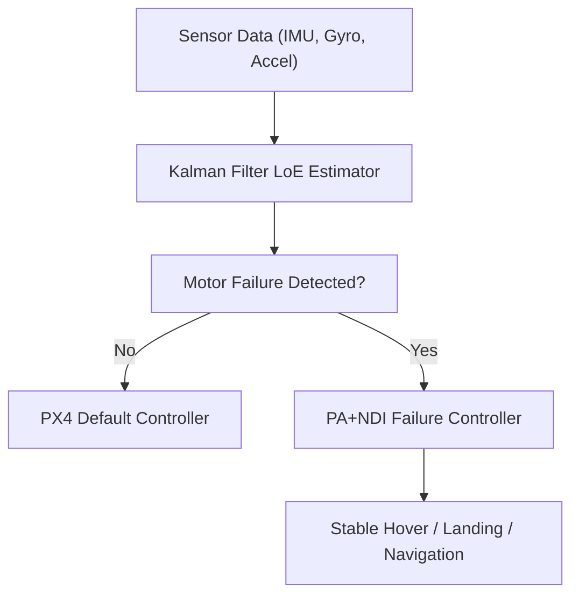
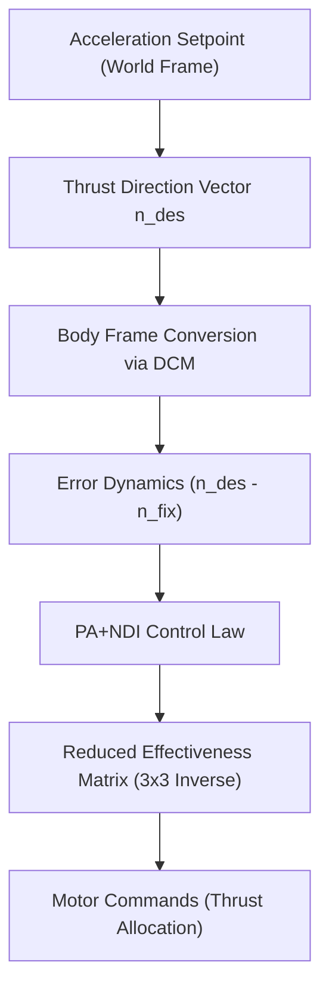
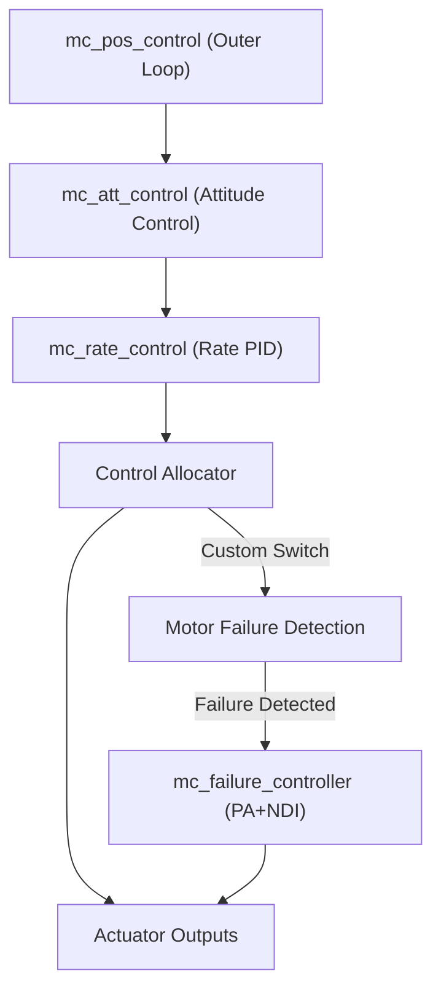

# ideaForge – Fault-Tolerant Quadrotor Control for Single Motor Failure

## Source – [IIT Bombay’s Inter-IIT Tech Meet 13.0 Submission for ideaForge[(https://drive.google.com/file/d/1Uq4B0OX8CZ0i_GVhjLo_ywHdU18klgjQ/view?usp=sharing)

---

## Table of Contents

1. [Problem Statement](#problem-statement)
2. [Background](#background)
3. [Solution Overview](#solution-overview)
4. [System Architecture](#system-architecture)

   * [Simulation Setup](#simulation-setup)
   * [Hardware Platform](#hardware-platform)
5. [Motor Failure Detection](#motor-failure-detection)
6. [Fault-Tolerant Controller Design](#fault-tolerant-controller-design)

   * [Inner Loop Control](#inner-loop-control)
   * [Outer Loop Control](#outer-loop-control)
7. [Software Architecture](#software-architecture)

   * [PX4 Stack Integration](#px4-stack-integration)
   * [Failure Injection & Switching Logic](#failure-injection--switching-logic)
8. [Results](#results)
9. [Challenges & Lessons Learned](#challenges--lessons-learned)
10. [Improvements & Applications](#improvements--applications)
11. [References](#references)

---

## Problem Statement

Develop a **software-only fault-tolerant control system** for a **quadrotor UAV** that can maintain **stability and safe operation** in case of a **single motor failure** — without any hardware redundancy or additional sensors.

The system must:

* Detect motor failure using onboard sensor data.
* Switch to a custom controller within milliseconds.
* Maintain **stable hover**, **controlled descent**, and **limited navigation** after failure.
* Integrate with **[PX4 Autopilot](https://docs.px4.io/main/en/)** firmware and validate via **[Gazebo SITL](https://classic.gazebosim.org/)** and hardware testing.

---

## Background

A **quadrotor UAV** is an **underactuated 6-DOF system** controlled by 4 rotors.
A single motor failure breaks control over yaw torque, making the vehicle dynamically unstable.

However:

* **Yaw control can be sacrificed** to stabilize roll, pitch, and altitude.
* With appropriate fault detection and reallocation, a quadrotor can still hover and land safely.

Existing approaches:

* Rely on **[Extended Kalman Filter (EKF)](https://en.wikipedia.org/wiki/Extended_Kalman_filter)** or **[Unscented Kalman Filter (UKF)](https://en.wikipedia.org/wiki/Unscented_Kalman_filter)** for failure estimation.
* Use adaptive control methods like **[Primary Axis Nonlinear Dynamic Inversion (PA+NDI)](https://ieeexplore.ieee.org/document/9363621)** or **Linear Parameter-Varying (LPV)** control.
* Require specialized ESC feedback — which this work **avoids** to keep it low-cost and deployable.

---

## Solution Overview

The proposed system combines:

1. **Kalman Filter–based Loss-of-Effectiveness (LoE) Estimation** for failure detection.
2. **PA+NDI fault-tolerant controller** for recovery.
3. **Modular integration with PX4 firmware** for real-time switching.



**Highlights:**

* No hardware modification or redundant sensors.
* Robust to noise and non-linearities.
* Successfully tested in simulation and on custom-built hardware.

---

## System Architecture

### Simulation Setup

* **Simulator:** [Gazebo Classic](https://classic.gazebosim.org/) (realistic physics + wind dynamics).
* **Vehicle Model:** Iris quadrotor (X-configuration).
* **Interface:** [MAVLink](https://mavlink.io/en/) through [QGroundControl](https://docs.qgroundcontrol.com/).
* **Failure Testing:** Software-in-the-loop (SITL) with live failure injection.


---

### Hardware Platform

| Component | Specification                     |
| --------- | --------------------------------- |
| Frame     | GEPRC Mark 4 V2 (X configuration) |
| FC        | Pixhawk Cube Orange               |
| ESC       | SpeedyBee BLS 60A 4-in-1          |
| Motor     | EMAX ECOII 2306-1700KV            |
| Propeller | Gemfan Flash 7040 Tri-blade       |
| GPS       | Holybro M10 Micro                 |
| Telemetry | Holybro Sik V3 (433 MHz)          |
| Battery   | 1500 mAh 6S 120C LiPo             |

Measured via pendulum and torsional tests for moment of inertia, following [Setati et al., MATEC Web Conf. 2022](https://doi.org/10.1051/matecconf/202237005001).

---

## Motor Failure Detection

Implemented a **Kalman Filter–based Loss-of-Effectiveness (LoE)** estimator (adapted from [Schijndel et al., 2023](https://ieeexplore.ieee.org/document/10161208)).

```math
z = H(u)x
```

where

* ( z = [ṗ, q̇, ȧ_z]^T ) → measured angular & linear accelerations
* ( x = [k_1, k_2, k_3, k_4]^T ) → control effectiveness vector
* ( H(u) ) → control-input-dependent observation matrix

Motor failure is flagged when:

```math
P(k̂_i < k_{thresh}) > 1 - \epsilon
```

and persists for `min_counts` iterations.

### Enhancements:

* **First-order low-pass filtering** of accelerations to suppress IMU noise.
* **Offline MATLAB tuning** of noise covariance matrices (Q, R).
* **Real-time switching threshold (Pthresh = 0.9999)** for accurate detection within 160 ms.

---

## Fault-Tolerant Controller Design

### Inner Loop Control – PA+NDI Controller

Implements **Primary Axis Nonlinear Dynamic Inversion**, ensuring stable attitude despite loss of yaw control.

#### Control Pipeline:



**Key Idea:**
After motor failure, remove yaw torque and reallocate thrust via reduced effectiveness matrix ( \tilde{G}^{-1} ):

```math
[u_1^2, u_2^2, u_3^2, u_4^2]^T = \tilde{G}^{-1} [\tau_x, \tau_y, 0, T]^T
```

**Stabilization Mechanism:**

* Keeps roll, pitch, and altitude bounded.
* Allows yaw drift while maintaining hover.
* Recovers altitude within ±5% of nominal after 12 s.

---

### Outer Loop Control – Position PD Controller

Computes desired accelerations for the PA+NDI inner loop:

```math
a_{x,des} = k_p (p_{x,sp} - p_x) + k_d (v_{x,sp} - v_x)
```

Same formulation for ( a_y, a_z ).
Operates at 50 Hz; executes once every 5 iterations for efficiency.

---

## Software Architecture

### PX4 Stack Integration



**Custom PX4 Modules:**

* `motor_failure_detection` → Kalman-based estimator.
* `mc_failure_controller` → fault-tolerant PA+NDI control logic.
* `failure_simulator` → injects simulated motor failure via MAVLink topic.

---

### Failure Injection & Switching Logic

1. **Injection:** Software-defined; target motor set to zero via `control_allocator`.
2. **Detection:** `motor_failure_detection` publishes failure probability.
3. **Switching:**

   * `mc_failure_controller` replaces default PX4 attitude controller.
   * Safe manual override enabled for pilot intervention.

**Failsafe:** Detection disabled for first few seconds after takeoff to avoid false positives.

---

## Results

| Test Case        | Detection Time | Hover Stability     | Altitude Error | Remark                              |
| ---------------- | -------------- | ------------------- | -------------- | ----------------------------------- |
| Hover            | **160 ms**     | ±10° roll/pitch     | 5% (≈ 1 m)     | Stable recovery                     |
| Hover + Yaw Rate | < 250 ms       | Bounded oscillation | < 1.5 m        | Handles initial yaw up to 2.5 rad/s |
| Landing          | —              | Smooth descent      | 0.5 m/s        | Comparable to normal PX4            |
| Navigation       | —              | < 1.75 m RMS error  | —              | Tracks waypoints accurately         |

---

## Challenges & Lessons Learned

| Challenge                         | Solution                                              |
| --------------------------------- | ----------------------------------------------------- |
| Noisy sensor data                 | Low-pass filtering on accelerations                   |
| False positives at takeoff        | Detection delay and threshold hysteresis              |
| Control nonlinearity post-failure | Dynamic inversion with tilted thrust axis             |
| Hardware safety                   | Protective test cage, manual override                 |
| Parameter mismatch                | Experimental inertia & thrust coefficient calibration |

---

## Improvements & Applications

**Algorithmic Enhancements**

* Partial rotor degradation handling (actuator gain < 1).
* Multi-rotor failure compensation via LPV or RL controllers.
* Advanced state estimation with [Unscented Kalman Filter (UKF)](https://en.wikipedia.org/wiki/Unscented_Kalman_filter).
* PID tuning via flight data and ML optimization.

**Applications**

* **Defense & Reconnaissance:** Mission reliability in high-risk zones.
* **Disaster Response:** Controlled flight under debris damage.
* **Infrastructure Inspection:** Safe descent during partial failure.

---

## References

1. [Valavanis & Vachtsevanos, *Handbook of UAVs*, Springer, 2014](https://doi.org/10.1007/978-90-481-9707-1)
2. [Amoozgar et al., *Two-Stage Kalman Filter for Actuator Fault Detection*, JIRS, 2013](https://doi.org/10.1007/s10846-012-9749-1)
3. [Sun et al., *Autonomous Flight Despite Rotor Failure*, IEEE RA-L, 2021](https://ieeexplore.ieee.org/document/9363621)
4. [PX4 Autopilot Documentation](https://docs.px4.io/main/en/)
5. [uORB Middleware – PX4 IPC](https://docs.px4.io/main/en/middleware/uorb.html)
6. [Nonlinear Attitude Control – ETH Zurich Report, 2013](https://docs.px4.io/main/en/flight_stack/controller_diagrams.html)

---

### Credits – IIT Bombay Team ideaForge members

**Archit Gupta  | Gopinath Tejavath | Anway Deshpande  | Tanmay Nitul  | Pritesh | Urvi Gupta | Saumya Dharmesh Shah | Jainam Ravani  | Jeet Gurbani  | Divyanshu Gupta | Rohan Joshi | Aagam Kasaliwal | Ashish Ranjan | Prashant Vashisht | Khushi Taxak | Anushka | Nishant Bhave | Tek Singh**

---

