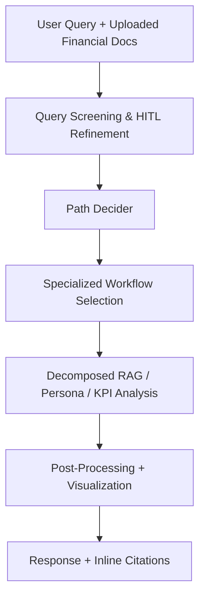
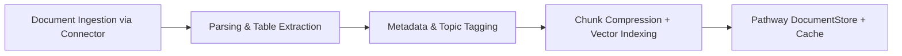
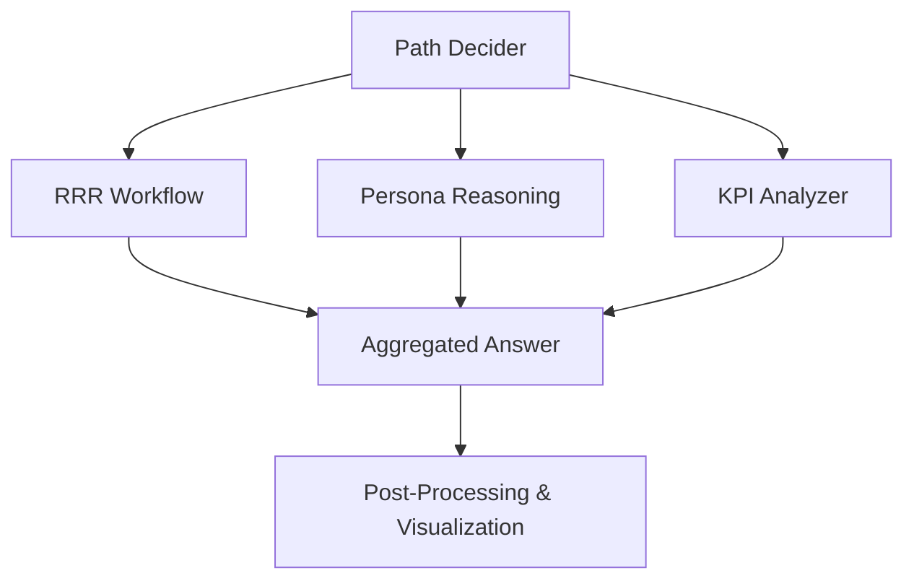
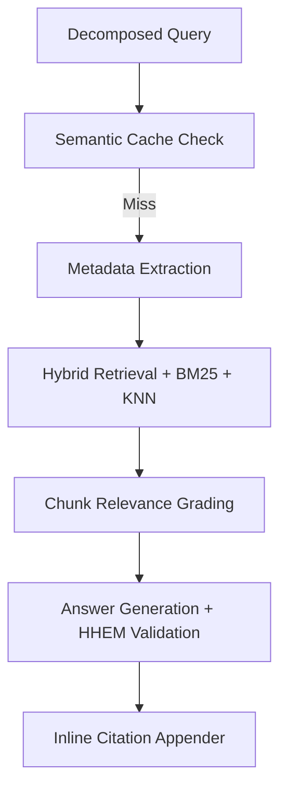
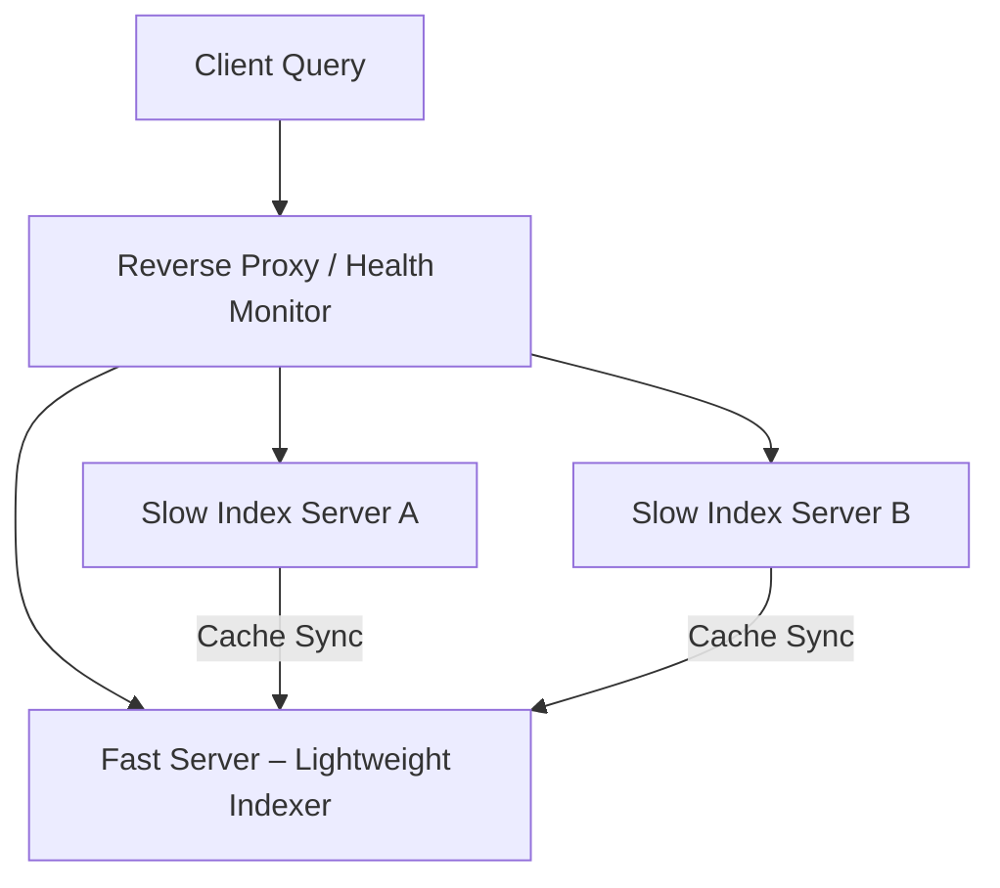

# FinSight – Dynamic Agentic RAG with Pathway

## Source – [IIT Bombay’s Inter-IIT Tech Meet 13.0 Submission for Pathway](https://drive.google.com/file/d/1_gKCH-HCHIFstMs82UdBrYQeLzMQomah/view?usp=sharing)

---

## Table of Contents

1. [Problem Statement](#problem-statement)
2. [Background & Motivation](#background--motivation)
3. [Solution Overview](#solution-overview)
4. [System Architecture](#system-architecture)

   * [Indexing](#indexing)
   * [Conversational Awareness](#conversational-awareness)
   * [Human-in-the-Loop](#human-in-the-loop)
   * [Specialized Workflows](#specialized-workflows)
   * [Query Decomposition](#query-decomposition)
   * [Path Decider](#path-decider)
   * [End-to-End RAG Pipeline](#end-to-end-rag-pipeline)
   * [Post-Processing](#post-processing)
   * [Server Architecture](#server-architecture)
5. [Results & Metrics](#results--metrics)
6. [Challenges & Solutions](#challenges--solutions)
7. [Resilience & Error Handling](#resilience--error-handling)
8. [User Interface](#user-interface)
9. [Responsible AI Practices](#responsible-ai-practices)
10. [Lessons Learned](#lessons-learned)
11. [Conclusion](#conclusion)
12. [References](#references)

---

## Problem Statement

Develop a **dynamic multi-agent Retrieval-Augmented Generation (RAG)** system using [Pathway](https://pathway.com) to build an *adaptive, finance-focused knowledge engine*.

Key objectives:

* Real-time, **scalable agent coordination** using Pathway’s dynamic document store.
* **Finance-centric intelligence**, interpreting textual + tabular data from documents (e.g., 10-K filings).
* Robust **query decomposition** and reasoning pipelines for *multi-hop financial queries*.
* Integration of **Responsible AI** and **Human-in-the-Loop (HITL)** controls for transparency.

---

## Background & Motivation

Existing financial LLMs like **BloombergGPT**, **FinGPT**, and **FinRobot** excel at narrow analytical tasks but fail in:

* Multimodal interpretation (text, charts, tables).
* Dynamic reasoning or cross-document aggregation.
* Transparent intermediate reasoning.

**FinSight** bridges these gaps via an **Agentic RAG framework** built atop [Pathway’s dynamic dataflow](https://pathway.com/docs/) — enabling *real-time adaptive retrieval, caching, and scaling*.

---

## Solution Overview

### Core Innovations

* **Dynamic Agentic RAG** pipeline using [LangGraph](https://github.com/langchain-ai/langgraph).
* **Recursive Residual Resolution (RRR)** for multi-hop query answering.
* **Financial persona agents** for reasoning across analyst viewpoints.
* **Hybrid Retrieval (BM25 + Dense KNN)** with Pathway’s real-time indexing.
* **Token-optimized vector stores** via [LLMLingua](https://www.microsoft.com/en-us/research/publication/llmlingua-compressing-prompts-for-accelerated-inference-of-large-language-models/).

---

## System Architecture

### Indexing

* Built using **Pathway connectors → tables → transformations** pipeline.
* **OpenParse + Visual LLMs** extract tables, text, and structure.
* Generates **Table-Value Maps** → `<table_name, row, column, significance>` improving numerical accuracy by 19%.
* Intradocument topic tags (35 for finance) enable targeted retrieval.
* **Prompt compression** (via LLMLingua) reduces tokens ~40%.

---

### Conversational Awareness

Maintains multi-turn context via:

* **Short-term memory** → last *K* user/system messages.
* **Distributed cache** → Pathway-indexed message metadata for contextual refinement.
  Ensures consistent reasoning across financial dialogues.

---

### Human-in-the-Loop

Three-round **query clarification** module to reduce ambiguity:

* Open, single-choice, or multi-choice clarifiers.
* Optional switch to **KPI-based analysis** triggered by user.
  Improves transparency and aligns responses to intent.

---

### Specialized Workflows

#### 1. Decomposed RAG Agent

Implements **RRR (Recursive Residual Resolution)** to iteratively resolve unanswered sub-queries.

#### 2. Dynamic Persona Workflow

Spawns contextual financial personas (e.g., *Analyst, Trader, Strategist*).
Two modes:

* *Parallel*: simultaneous multi-perspective reasoning.
* *Supervised*: sequential, supervisor-driven refinement.

#### 3. Financial Analysis Agent

Performs **KPI computation** via embedded code generation and [Pathway UDF caching](https://pathway.com/docs/user-guide/udfs/).

---

### Query Decomposition

Implements layered decomposition strategies:

| Method                                            | Description                                                                     |
| ------------------------------------------------- | ------------------------------------------------------------------------------- |
| **Parallel / Series-Parallel**                    | Hybrid multi-query resolution pipeline.                                         |
| **Generator–Critic**                              | Feedback-driven refinement loop for decomposition accuracy.                     |
| **[ConTReGen](https://arxiv.org/abs/2410.15511)** | Recursive tree-based breakdown for open-domain queries.                         |
| **RRR**                                           | Novel iterative loop for residual question resolution; +39% multi-hop accuracy. |

---

### Path Decider

Autonomous router directing queries through:

* **LLM path** – generic or open-domain.
* **Web search path** – live factual queries.
* **RAG path** – decomposed or persona reasoning for finance.
  Employs **dual-stage deciders** with conversation-aware context combiner.

---

### End-to-End RAG Pipeline

* **Semantic caching** ([Redis Semantic Cache](https://redis.io/blog/what-is-semantic-caching/)) avoids redundant compute.
* **Hybrid retrieval** (BM25 + KNN) with metadata filters (company, year, topic).
* **Hallucination detection** via [HHEM v2](https://www.vectara.com/blog/hhem-v2-a-new-and-improved-factual-consistency-scoring-model).
* **Answer Grader** ensures factual alignment.
* **HyDE (Hypothetical Document Embeddings)** for robust query rewriting.
* Inline **citation mapper** anchors evidence in responses.

---

### Post-Processing

Transforms raw model output into actionable **financial insights**:

* Validates data quality.
* Computes **derived KPIs** via embedded calculator agents.
* Generates charts & narratives (e.g., trend, profitability, liquidity).
* Produces exportable **visualizations** via JSON→Plotly pipeline.

---

### Server Architecture

To prevent downtime during re-indexing, a **tri-server architecture** is used:

* Continuous query availability while documents re-index.
* Seamless switching via Pathway-extended **DocumentStoreServer**.

---

## Results & Metrics

### Benchmarks

* **Financial-QA-10k**, **Custom Multi-Hop Financial Dataset**.
* Evaluated on **Correctness**, **Faithfulness**, **Relevancy**, **Context Precision**, **Latency**, and **Token Usage**.

### Key Findings

| Improvement              | Metric Gain              |
| ------------------------ | ------------------------ |
| Table-Value Map          | +19% Correctness         |
| RRR over Naive RAG       | +39% Multi-Hop Accuracy  |
| Hybrid Retrieval         | +6% Precision            |
| LLMLingua Compression    | 40% Token Reduction      |
| Embedding Model Agnostic | <2% variance across LLMs |

Hybrid retriever (BM25 + KNN) achieved best balance of speed & accuracy with *k = 5*.

---

## Challenges & Solutions

| Challenge                      | Resolution                                                       |
| ------------------------------ | ---------------------------------------------------------------- |
| Query blocking during indexing | Dual fast/slow server with proxy routing                         |
| Token inefficiency             | Prompt compression via LLMLingua + custom Pathway transformation |
| Unstructured JSON from LLMs    | Custom OutputFixing + Pydantic parsers                           |
| OpenParse bounding box errors  | Vision-LLM table parsing + table-value maps                      |
| Ambiguous summaries            | Persona-based decomposition + query expansion                    |

---

## Resilience & Error Handling

* **Fallback LLM switching** (OpenAI → Anthropic → Llama).
* **Tiered web retrieval**: Tavily → Google → Bing → Scraping.
* **Checkpointed workflows** for state recovery.
* **Exponential backoff retries** on parsing failures.

---

## User Interface

Built with **React 18 + Vite + Tailwind CSS + FastAPI backend**.

Features:

* Multimodal chat (text / image / speech).
* **Citations with hover previews**.
* Workspace-based conversation memory.
* Live trace visualization of LangGraph agent flows.
* WebSocket-based real-time updates and KPI chart generation.

---

## Responsible AI Practices

Aligned with [Microsoft Responsible AI Standard v2](https://blogs.microsoft.com/wp-content/uploads/prod/sites/5/2022/06/Microsoft-Responsible-AI-Standard-v2-General-Requirements-3.pdf).

### Key Components

* **Hallucination Mitigation** → HHEM v2 scoring per node.
* **Safety Agent** → MLCommons AI Safety Benchmark enforcement.
* **Transparent Citations** → Source-anchored inline referencing.
* **User-defined source filtering** for trusted data retrieval.

---

## Lessons Learned

* **Open-source embeddings (BGE-M3)** outperform proprietary Ada models.
* Multi-agent architectures outperform monolithic LLMs in **reasoning depth and interpretability**.
* Proper **reasoning chains and decomposition** drastically reduce hallucination.
* Domain-specific personas improve faithfulness of qualitative responses.

---

## Conclusion

**FinSight** sets a benchmark for **agentic financial intelligence systems**.
By leveraging [Pathway’s dynamic vector architecture](https://pathway.com/docs/), it achieves:

* Scalable, low-latency retrieval under continuous indexing.
* Modular agentic reasoning via **RRR**, **ConTReGen**, and **persona frameworks**.
* Real-time visualization and ethical reasoning guarantees.

The architecture is **domain-agnostic** and extensible to any high-context RAG domain — legal, medical, or research analytics.

---

## References

1. [Pathway Documentation](https://pathway.com/docs/)
2. [LangGraph Framework](https://github.com/langchain-ai/langgraph)
3. [ConTReGen – Context-Tree Generation](https://arxiv.org/abs/2410.15511)
4. [LLMLingua – Prompt Compression](https://www.microsoft.com/en-us/research/publication/llmlingua-compressing-prompts-for-accelerated-inference-of-large-language-models/)
5. [HHEM v2 – Hallucination Detection](https://www.vectara.com/blog/hhem-v2-a-new-and-improved-factual-consistency-scoring-model)
6. [MLCommons AI Safety Benchmark](https://arxiv.org/abs/2404.12241)
7. [Redis Semantic Cache](https://redis.io/blog/what-is-semantic-caching/)
8. [FinGPT](https://arxiv.org/abs/2306.06031)
9. [FinRobot](https://arxiv.org/abs/2405.14767)
10. [BloombergGPT](https://arxiv.org/abs/2303.17564)

---

### Credits – IIT Bombay Team Pathway Members

**Adyasha Patra | Atishay Jain | Shreyash Gupta | Resnick Singh | Divyanshu Suman | Ayush Jadia | Tanmay Mandaliya | Aryan Gupta | Shetty Sathwik Prakash  | Aishwarya | Mridul Sharma | Geet Sethi | Saptarshi | Deepak Silaych | Morj | Hrishikesh Jedhe Deshmukh | Karthikeyan J | Kartik Nair**

---

