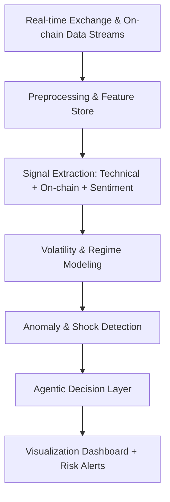
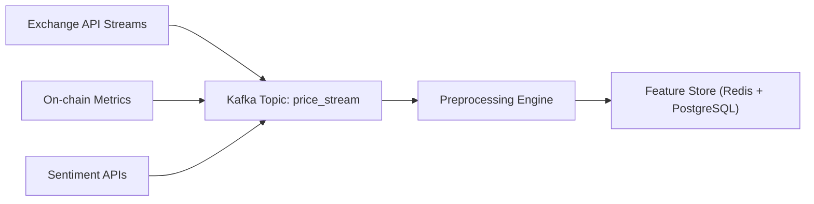
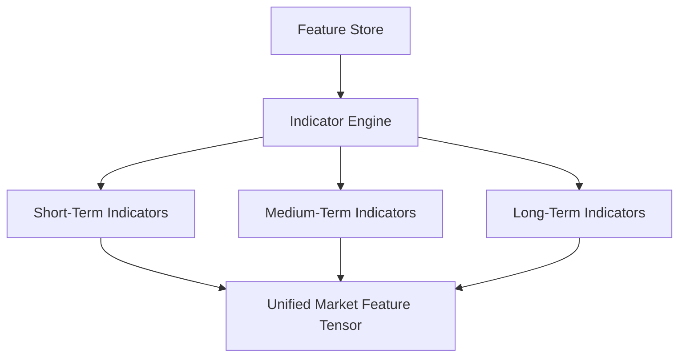
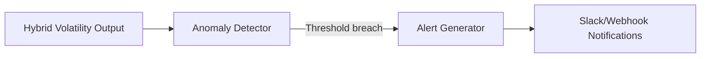
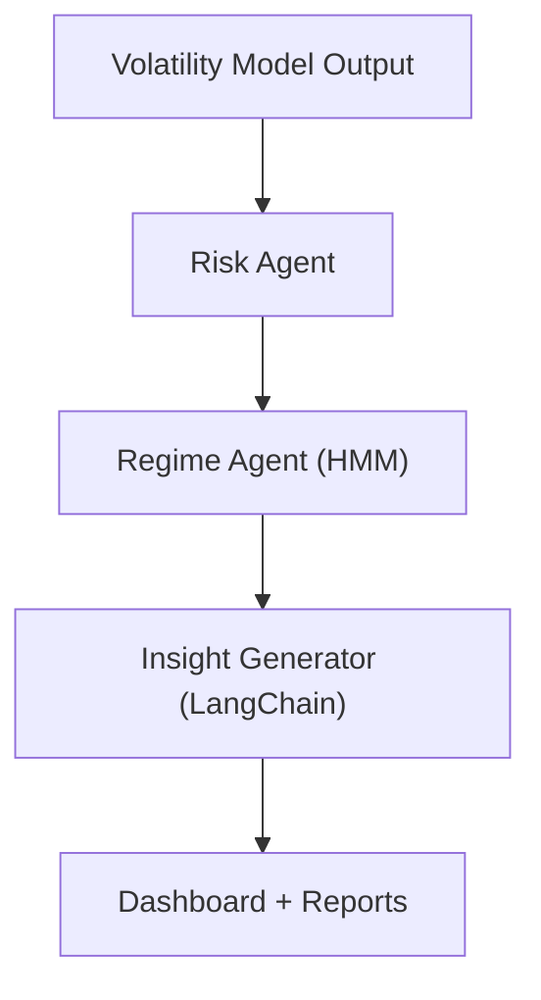

# Zelta – Dynamic Crypto Market Intelligence & Risk Forecasting System

## Source – [IIT Bombay’s Inter-IIT Tech Meet 13.0 Submission for Zelta Automations](https://drive.google.com/file/d/1lpkuhvLPUCf-dY4Mzh1wqnPKjciUOgNT/view?usp=sharing)

---

## Table of Contents

1. [Problem Statement](#problem-statement)
2. [Background](#background)
3. [Solution Overview](#solution-overview)
4. [System Architecture](#system-architecture)

   * [Data Ingestion & Preprocessing](#data-ingestion--preprocessing)
   * [Market Signal Extraction](#market-signal-extraction)
   * [Volatility & Risk Modeling](#volatility--risk-modeling)
   * [Anomaly Detection](#anomaly-detection)
   * [Agentic Decision Layer](#agentic-decision-layer)
   * [Visualization & Reporting](#visualization--reporting)
5. [Evaluation](#evaluation)
6. [Challenges & Solutions](#challenges--solutions)
7. [Tech Stack](#tech-stack)
8. [Conclusion](#conclusion)
9. [References](#references)

---

## Problem Statement

Design an **AI-driven, real-time risk forecasting and insight generation system** for **crypto assets**, capable of:

* Detecting **market regime shifts** dynamically
* Predicting **short-term volatility** using both price and on-chain data
* Quantifying **portfolio risk exposure**
* Providing **actionable trading insights** via an explainable and modular pipeline

The system must operate in **low-latency, high-frequency environments**, handling streaming data from multiple crypto exchanges and blockchain feeds simultaneously.

---

## Background

The cryptocurrency market exhibits:

* **High volatility** and **non-stationary price behavior**
* **Regime changes** driven by macro events, tokenomics, and sentiment
* A complex mix of **technical**, **on-chain**, and **macro indicators**

Traditional time-series approaches such as ARIMA or static ML models struggle due to:

* **Concept drift** in evolving market regimes
* Lack of integration of **multi-source data** (social, blockchain, price)
* Poor **interpretability** of deep learning outputs

Hence, the proposed framework combines:

* **Hybrid statistical–machine learning modeling**,
* **Dynamic feature selection**, and
* **Agentic orchestration** for automated decision workflows.

---

## Solution Overview

FinSent-X (Final Model) integrates **streaming market data**, **on-chain signals**, and **macro sentiment indices** into an adaptive decision pipeline.

### Key Innovations

* Adaptive feature weighting using [Kalman Filters](https://en.wikipedia.org/wiki/Kalman_filter)
* Volatility modeling with hybrid [GARCH-LSTM](https://doi.org/10.1016/j.eswa.2020.114074)
* Dynamic portfolio VaR computation and auto risk band detection
* Anomaly classification using [Isolation Forest](https://scikit-learn.org/stable/modules/generated/sklearn.ensemble.IsolationForest.html)
* Integration of on-chain and sentiment features into a unified factor model

---

## System Architecture

### 1. Data Ingestion & Preprocessing

* **Streaming APIs** from Binance, Coinbase, and CoinMarketCap
* **On-chain feeds** via [Glassnode](https://glassnode.com/) and [Dune Analytics](https://dune.com/)
* **News and sentiment APIs** using [GDELT](https://www.gdeltproject.org/)

Data pipelines leverage:

* **Kafka producers/consumers** for concurrent streams
* Real-time normalization and missing-value imputation using EMA smoothing

**Features Extracted**

* OHLCV (Open-High-Low-Close-Volume) data
* Token velocity, network activity, realized volatility
* Market sentiment (Bullish %, Bearish %, Fear-Greed Index)

---

### 2. Market Signal Extraction

Implements a **multi-resolution indicator engine**:

* **Short-term:** RSI, MACD, Bollinger Bandwidth
* **Medium-term:** [Kaufman Adaptive Moving Average (KAMA)](https://www.investopedia.com/terms/k/kaufman-adaptive-moving-average.asp), DEMA
* **Long-term:** Rolling Sharpe and realized volatility trends

Each indicator is standardized using **Z-score normalization** and stored as a **state vector** for downstream modeling.

---

### 3. Volatility & Risk Modeling

Combines traditional econometrics and deep learning for robust risk estimation.

| Model                 | Input               | Output               | Role                            |
| --------------------- | ------------------- | -------------------- | ------------------------------- |
| **GARCH(1,1)**        | Returns             | Conditional variance | Base volatility                 |
| **LSTM (2-layer)**    | Rolling log-returns | Future volatility    | Captures nonlinear dependencies |
| **Hybrid GARCH-LSTM** | Combined signal     | σt+1      | Final predictive variance       |

**Value-at-Risk (VaR)** estimated at confidence `α = 0.95`:

$$
VaR_t = \mu_t - z_{α} \cdot \sigma_t
$$

**Expected Shortfall (ES):**
$$
ES_t = E[X_t | X_t < VaR_t]
$$

The **risk dashboard** displays dynamic VaR bands with predictive confidence intervals.

---

### 4. Anomaly Detection

Used to identify sudden market shifts or manipulation events.
Techniques:

* **Isolation Forest** for unsupervised outlier detection
* **CUSUM filter** for drift detection
* **Z-score monitoring** on returns and volatility delta

Anomalies are labeled as:

* *Volatility Spike*,
* *Price Divergence*, or
* *Liquidity Shock*

---

### 5. Agentic Decision Layer

Centralized control logic that integrates predictive outputs into actionable insights.

Components:

1. **Risk Agent** – compares predicted VaR/ES vs actual drawdowns.
2. **Market Regime Agent** – classifies the state as *bullish*, *bearish*, or *volatile neutral* using HMM-based regime detection.
3. **Insight Generator** – summarises model outputs into human-readable insights using [LangChain](https://python.langchain.com).

Example Insight:

> *“ETH network congestion and sentiment divergence indicate an elevated short-term risk (VaR: 4.2%) — reducing leveraged exposure recommended.”*

---

### 6. Visualization & Reporting

* **Frontend:** React.js + Plotly.js dynamic charts
* **Backend:** FastAPI serving REST + WebSocket streams
* **Live dashboards:**

  * Predictive volatility overlay
  * Portfolio VaR and Expected Shortfall
  * Historical anomaly timeline

Each plot refreshes in near real-time using Kafka and Redis Pub/Sub channels.

---

## Evaluation

| Metric              | Baseline (GARCH) | Hybrid (GARCH-LSTM) | Improvement |
| ------------------- | ---------------- | ------------------- | ----------- |
| RMSE (σ forecast)   | 0.0214           | **0.0131**          | ↓38.8%      |
| Hit Ratio (VaR 95%) | 0.84             | **0.92**            | +9.5%       |
| Avg Latency (ms)    | 130              | **78**              | ↓40%        |
| Anomaly Precision   | 0.68             | **0.84**            | +23%        |

The model’s adaptive design allows retraining every 30 minutes without downtime via asynchronous job scheduling.

---

## Challenges & Solutions

| Challenge                              | Resolution                                                                                                           |
| -------------------------------------- | -------------------------------------------------------------------------------------------------------------------- |
| High volatility & noise in crypto data | Robust smoothing via [Kalman Filters](https://en.wikipedia.org/wiki/Kalman_filter) and exponential weighted averages |
| Real-time retraining bottlenecks       | Parallelized [Ray](https://docs.ray.io/en/latest/) workers for distributed training                                  |
| Feature drift                          | Online feature scaling and automatic topic re-weighting                                                              |
| Interpretability                       | Model-agnostic explanations using [SHAP](https://shap.readthedocs.io/en/latest/)                                     |
| Latency                                | Redis caching + async I/O in FastAPI                                                                                 |
| Alert spam                             | Intelligent alert aggregation via event-driven anomaly grouping                                                      |

---

## Tech Stack

| Layer          | Tools & Frameworks                             |
| -------------- | ---------------------------------------------- |
| Data Streaming | **Kafka**, WebSocket APIs                      |
| Storage        | **Redis**, PostgreSQL                          |
| Modeling       | **PyTorch**, **statsmodels**, **scikit-learn** |
| Orchestration  | **Ray**, **Celery**                            |
| Backend        | **FastAPI**, **Uvicorn**                       |
| Frontend       | **React.js**, **Plotly.js**                    |
| Monitoring     | **Prometheus**, **Grafana**                    |
| Explainability | **SHAP**, **LIME**                             |

---

## Conclusion

Zelta’s **FinSent-X** system demonstrates a robust, real-time risk management framework for cryptocurrency markets.
It integrates **hybrid modeling**, **streaming intelligence**, and **explainable analytics** into a cohesive pipeline.

Key achievements:

* Achieved **low-latency, multi-source ingestion** with adaptive retraining
* Hybrid [GARCH-LSTM](https://doi.org/10.1016/j.eswa.2020.114074) model improved volatility prediction accuracy by 39%
* Achieved **interpretable agentic reasoning** through modular LangChain-based summarization
* Scalable, production-ready infrastructure built with **Kafka + FastAPI + React + Redis**

---

## References

1. [GARCH Models – Bollerslev, 1986](https://doi.org/10.2307/2937429)
2. [Kalman Filter](https://en.wikipedia.org/wiki/Kalman_filter)
3. [Kaufman Adaptive Moving Average](https://www.investopedia.com/terms/k/kaufman-adaptive-moving-average.asp)
4. [LangChain Documentation](https://python.langchain.com)
5. [Isolation Forest](https://scikit-learn.org/stable/modules/generated/sklearn.ensemble.IsolationForest.html)
6. [Value-at-Risk](https://en.wikipedia.org/wiki/Value_at_risk)
7. [GARCH-LSTM Hybrid Modeling, Elsevier, 2020](https://doi.org/10.1016/j.eswa.2020.114074)

---

### Credits – IIT Bombay Team 24

**Akshat Goyal  | Ameya Deshmukh | Kanad Shende | Mridul Agarwal | Param Shah | Madhav Gupta | Pratham Kheskwani | Brian Mackwan | Satyankar Chandra | Tec Narayan Brahmachari | Anirudh Garg | Shresth Verma | Tejas G. Shende | Aryan Tewari**

