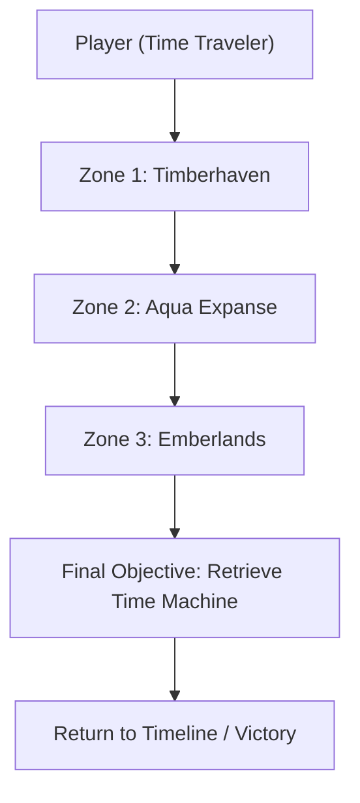
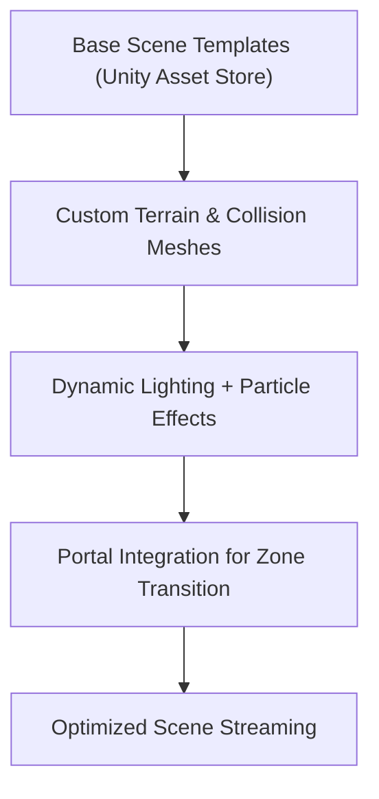
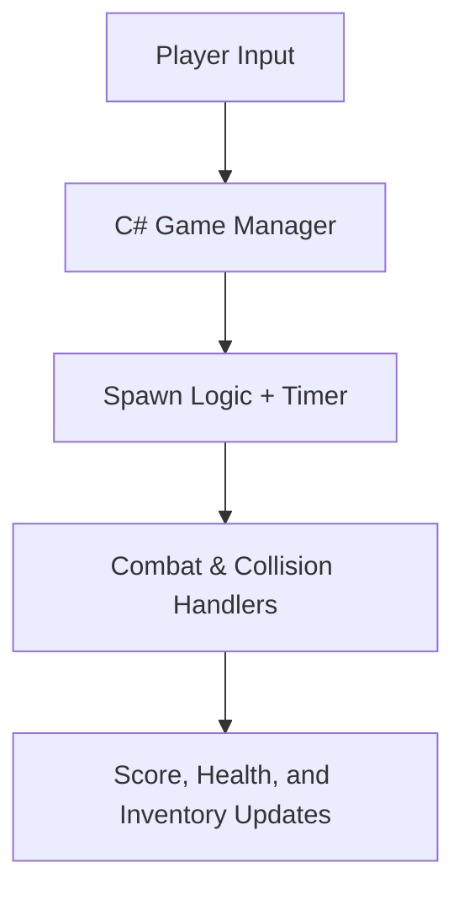
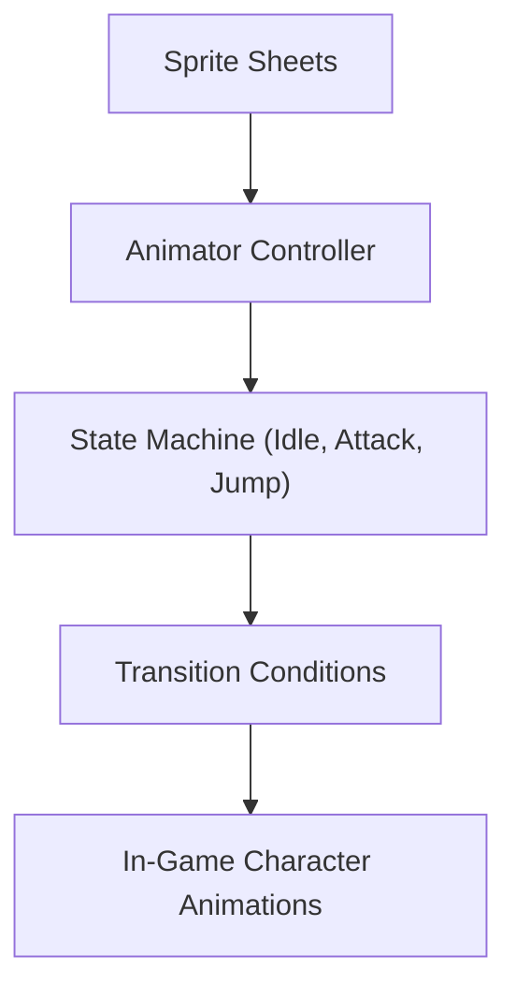

# ChronoWilds – 2D Time-Travel Survival Game

## Source – [IIT Bombay’s Inter-IIT Tech Meet 13.0 Submission for IGDC (Game Design and Development)](https://docs.google.com/presentation/d/1J4IFSOHN2R_FSSryacHmatbINe22WEuS/edit?usp=sharing&ouid=116717677983540255359&rtpof=true&sd=true)

---

## Table of Contents

1. [Problem Statement](#problem-statement)
2. [Background](#background)
3. [Game Concept](#game-concept)
4. [Game Architecture](#game-architecture)

   * [Level and Environment Design](#level-and-environment-design)
   * [Character & Enemy Systems](#character--enemy-systems)
   * [Core Game Mechanics](#core-game-mechanics)
   * [Scene Integration](#scene-integration)
   * [User Interface (UI) & Experience (UX)](#user-interface-ui--experience-ux)
5. [Autonomous Worlds & Adaptive Behavior](#autonomous-worlds--adaptive-behavior)
6. [Technical Implementation](#technical-implementation)

   * [Game Engine & Tools](#game-engine--tools)
   * [Animation Pipeline](#animation-pipeline)
   * [Programming Architecture](#programming-architecture)
7. [Results](#results)
8. [Challenges & Lessons Learned](#challenges--lessons-learned)
9. [Future Improvements](#future-improvements)
10. [References](#references)

---

## Problem Statement

Design a **2D time-travel adventure game** that merges **dynamic landscapes**, **autonomous AI entities**, and **player-driven progression**.
The game must:

* Deliver a **thematic link** to *Timeless Technopolis* (the Inter-IIT 13.0 theme).
* Implement **autonomous enemies** with adaptive responses.
* Exhibit **procedural environmental evolution** and **resource-based survival gameplay**.
* Be built as an **end-to-end executable** with integrated UI, animations, and level transitions.

---

## Background

**ChronoWilds** is inspired by *H.G. Wells’ “The Time Machine”* and is set in the distant future (802,701 AD), long after humanity has vanished.
The player, a time traveler, must survive across **three evolving biomes**—each representing a primal element and unique threat.

| Zone             | Environment           | Element | Enemy Type                          |
| ---------------- | --------------------- | ------- | ----------------------------------- |
| **Timberhaven**  | Dense forest          | Earth   | Predatory creatures & ground beasts |
| **Aqua Expanse** | Water-dominated realm | Water   | Amphibious and aquatic monsters     |
| **Emberlands**   | Volcanic wasteland    | Fire    | Flying and flame-based entities     |

The gameplay explores **evolutionary survival**, **adaptation**, and **strategic decision-making** in a changing, hostile environment.

---

## Game Concept

Each zone evolves dynamically as players progress, with new hazards and enemy patterns introduced per level.
Gameplay progression follows a **tiered level structure**:

* Level 1 of all zones → Level 2 of all zones → Level 3 of all zones.

This cyclic design ensures **increasing difficulty and world coherence**.

---

## Game Architecture

### Level and Environment Design

The design workflow used **[Unity 2D](https://unity.com/2d)** scenes, **tilemaps**, and layered parallax backgrounds to achieve depth.

Key mechanics:

* **Dynamic terrains** evolve between levels.
* Transitions between zones occur via **interactive portals** (trigger colliders).
* Backgrounds dynamically adjust using **Timeline-based keyframes**.

---

### Character & Enemy Systems

1. **Player Controller:**

   * Developed in C# with **Rigidbody2D** physics and **Animator Controllers**.
   * Includes attack, roll, jump, and resource management modules.

2. **Enemy AI:**

   * Implemented with **autonomous behavior trees**, allowing enemies to patrol, chase, and attack.
   * “Ghost” enemies in final stages force the player to use the **weakest weapon**, promoting strategy.

---

### Core Game Mechanics

* **Progressive Combat System** with melee and ranged weapons.
* **Health & Time Mechanics:** Player must survive each biome before timer depletion.
* **Adaptive Enemy Spawns:** Spawn rates tied to player health and score using Unity’s `Random.Range()` within preset bounds.

---

### Scene Integration

Scenes were integrated using Unity’s **SceneManager** and **persistent GameObjects** to maintain global state.

Features:

* Animated **scene transitions** between biomes.
* Smooth timeline-driven cutscenes using **[Unity Timeline](https://docs.unity3d.com/Manual/TimelineSection.html)**.
* Environmental cues like smoke, water flow, and lava bursts driven by **particle systems**.

---

### User Interface (UI) & Experience (UX)

The interface was designed for **clarity and immersion**:

* **Dynamic HUD** → Health, timer, and weapon info.
* **Menus & Pause system** → Implemented using Unity’s `CanvasGroup` and prefab management.
* **Instructional overlays** → Key prompts integrated through **Animator triggers**.

---

## Autonomous Worlds & Adaptive Behavior

A standout feature of ChronoWilds is its **autonomous environment simulation**.
Enemy AI and environment elements behave independently of player actions, making the world feel alive.

**Autonomous Agent Design:**

* Built using **Finite State Machines (FSMs)** implemented in C#.
* Agents adapt their aggression levels and patrol range dynamically based on player proximity and health.

| Behavior | Trigger             | Result                 |
| -------- | ------------------- | ---------------------- |
| Patrol   | Idle                | Wander in zone         |
| Alert    | Player within range | Track movement         |
| Attack   | Player in LOS       | Execute attack routine |
| Retreat  | Low HP              | Evade & respawn logic  |

This adaptive system mirrors early **[Game AI Architecture](https://gameprogrammingpatterns.com/state.html)** principles while remaining computationally light for 2D environments.

---

## Technical Implementation

### Game Engine & Tools

| Component            | Technology                                                                                     |
| -------------------- | ---------------------------------------------------------------------------------------------- |
| Game Engine          | [Unity 2022.3 LTS](https://unity.com/releases/lts)                                             |
| Programming Language | C#                                                                                             |
| Asset Pipeline       | [Unity Asset Store](https://assetstore.unity.com/) + Custom Sprite Sheets                      |
| Animation            | [Animator Controller](https://docs.unity3d.com/Manual/class-AnimatorController.html), Timeline |
| Scripting Backend    | .NET 6                                                                                         |
| Build Target         | Windows Executable (.exe)                                                                      |

---

### Animation Pipeline

Animations were handled through:

* **Keyframed transitions** within Animator Controller.
* **Parametric state management** via `Animator.SetBool()` and `Animator.SetTrigger()`.
* **Cinemachine camera blending** for smooth visual transitions.

---

### Programming Architecture

Each module was object-oriented and modular:

| Module               | Description                                       |
| -------------------- | ------------------------------------------------- |
| `GameManager.cs`     | Controls level progression, score, and scene flow |
| `EnemyController.cs` | Handles AI behaviors and attack routines          |
| `WeaponSystem.cs`    | Manages inventory and hit registration            |
| `PortalSystem.cs`    | Coordinates zone transitions                      |
| `UIManager.cs`       | Updates on-screen HUD and player feedback         |

---

## Results

| Feature           | Achieved Outcome                                    |
| ----------------- | --------------------------------------------------- |
| Evolving biomes   | Dynamic terrain changes across 3 elements           |
| AI behavior       | Fully autonomous FSM-driven entities                |
| Visual fidelity   | Parallax + particle effects for environment realism |
| Level progression | Sequential multi-zone with smooth transitions       |
| User immersion    | Timeline-driven cutscenes and contextual UI         |

The final product was compiled into a **single executable build**, enabling a seamless playthrough across all three zones.

---

## Challenges & Lessons Learned

| Challenge                       | Resolution                                  |
| ------------------------------- | ------------------------------------------- |
| Integrating dynamic backgrounds | Implemented Timeline keyframe interpolation |
| Maintaining 2D performance      | Optimized sprites via batch rendering       |
| Balancing AI difficulty         | Parameter-tuned FSM transitions             |
| UI responsiveness               | Used prefab pooling and Canvas scaling      |
| Scene linking bugs              | Introduced persistent GameManager singleton |

The team also gained:

* Experience in **Animator state design**, **prefab reuse**, and **sprite pipeline management**.
* Practical understanding of **game-theoretic balance** and **difficulty curves**.

---

## Future Improvements

* Transition to **3D environment** with hidden pathways and physics-based puzzles.
* Incorporate **LLM-based procedural storytelling** via [LangChain](https://python.langchain.com) for dynamic NPC dialogues.
* Employ **AutoGPT** and **BabyAGI** to evolve autonomous agents based on player decisions.
* Multiplayer expansion — cooperative time-travel missions and team-based survival.
* Advanced combat systems with customizable weapons and dynamic resource crafting.

---

## References

1. [Unity 2D Documentation](https://docs.unity3d.com/Manual/2DReferenceGuide.html)
2. [Animator Controllers](https://docs.unity3d.com/Manual/class-AnimatorController.html)
3. [Finite State Machine AI](https://gameprogrammingpatterns.com/state.html)
4. [Unity Timeline](https://docs.unity3d.com/Manual/TimelineSection.html)
5. [Cinemachine Camera System](https://docs.unity3d.com/Packages/com.unity.cinemachine@2.6/manual/index.html)
6. [AutoGPT](https://github.com/Torantulino/Auto-GPT) and [BabyAGI](https://github.com/yoheinakajima/babyagi) for autonomous AI extension
7. [Unity Asset Store](https://assetstore.unity.com/)

---

### Credits – IIT Bombay Team IGDC Members

**Ananya Chavadhal | Harigovind Raghunath | Aryash Srivastava  | Arnav Kumar | Saksham jain  | Manaswi Goyal**

---

