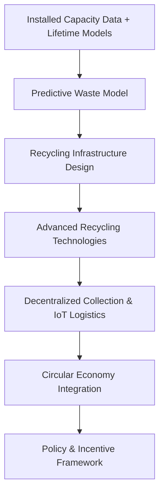
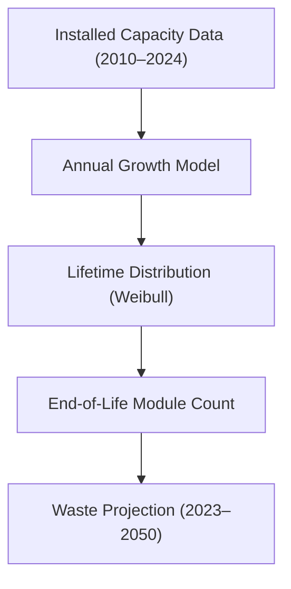
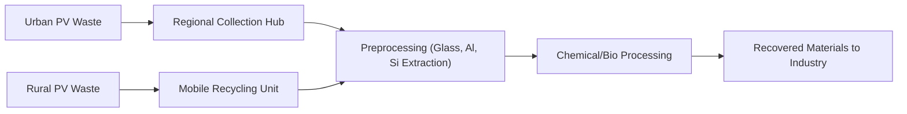
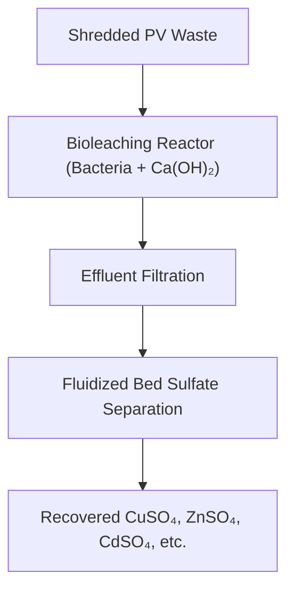
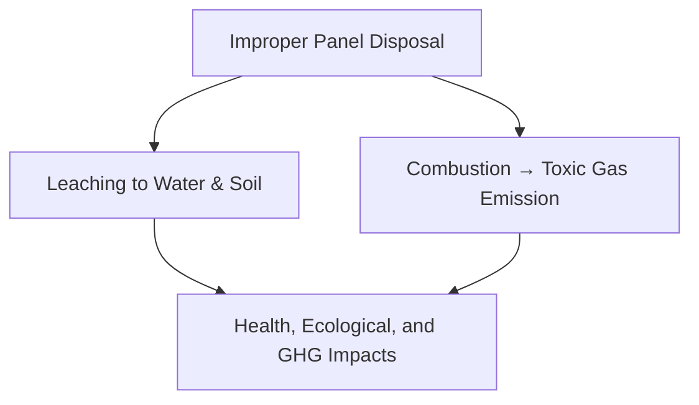
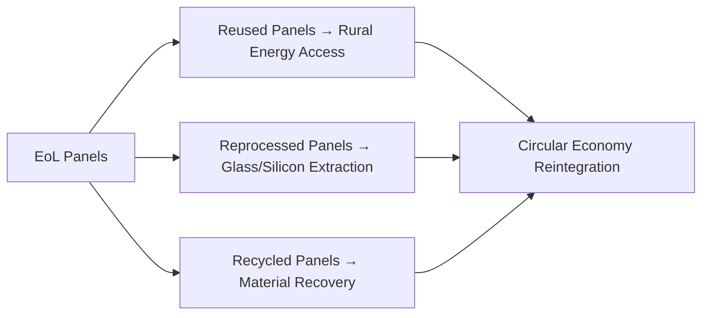

# Insolation Energy – Predictive Solar Waste Management & Circular Economy Framework

## Source – [IIT Bombay’s Inter-IIT Tech Meet 13.0 Submission for Insolation Energy](https://drive.google.com/file/d/1-r0BCILjBgrkP99nWTYimZJQB7TnVAPJ/view?usp=sharing)

---

## Table of Contents

1. [Problem Statement](#problem-statement)
2. [Background](#background)
3. [Solution Overview](#solution-overview)
4. [System Architecture](#system-architecture)

   * [Predictive Waste Modeling](#predictive-waste-modeling)
   * [Recycling Infrastructure Design](#recycling-infrastructure-design)
   * [Technological Innovations in Recycling](#technological-innovations-in-recycling)
   * [Decentralized Collection & Logistics](#decentralized-collection--logistics)
   * [Digital Technologies](#digital-technologies)
5. [Environmental Impact Assessment](#environmental-impact-assessment)
6. [Circular Economy Framework](#circular-economy-framework)
7. [Policy Recommendations](#policy-recommendations)
8. [Cost-Benefit Analysis](#cost-benefit-analysis)
9. [Challenges & Lessons Learned](#challenges--lessons-learned)
10. [Conclusion](#conclusion)
11. [References](#references)

---

## Problem Statement

With **India’s solar power capacity crossing 92 GW (2024)** and a target of **500 GW renewable capacity by 2030**, the nation faces a major upcoming issue — **solar photovoltaic (PV) waste**.

The challenge was to:

* Predict **solar panel waste generation trends till 2050** using data-driven modeling.
* Develop **technological and infrastructural frameworks** for recycling and resource recovery.
* Propose **economic and policy mechanisms** aligned with a **[Circular Economy](https://ellenmacarthurfoundation.org/topics/circular-economy-introduction/overview)** model.

The end goal is to **recover valuable materials** (like silicon, silver, aluminium) and **minimize environmental damage** from discarded panels.

---

## Background

India’s solar success is overshadowed by a hidden challenge — end-of-life (EoL) waste from millions of decommissioned PV modules.

Key insights:

* **~1.8 million tons of PV waste by 2050**, based on model projections.
* Improper disposal can cause **heavy metal leaching (Pb, Cd, Cu)** and **toxic gas emissions (HF, SO₂)**.
* **No specialized PV recycling framework** currently exists beyond generic [E-Waste Rules (2022)](https://www.mppcb.mp.gov.in/proc/E-Waste-Management-Rules-2022-English.pdf).

Hence, a **multi-dimensional approach** — technological, environmental, and policy-driven — is required.

---

## Solution Overview

A full-lifecycle solution integrates **prediction → recycling → circular economy → policy**.

**Key Objectives**

* Quantify and visualize PV waste growth.
* Design **scalable, decentralized recycling systems**.
* Integrate **bioleaching**, **microwave-assisted delamination**, and **enzymatic recycling**.
* Propose **financially viable circular pathways**.

---

## System Architecture

### Predictive Waste Modeling

The **solar waste forecasting model** combines historical installation data, projected growth, and lifecycle degradation.

#### Model Logic:

* Panel **lifetime = 25 years**
* **BAU**, **optimistic**, and **pessimistic** growth scenarios
* Accounts for:

  * Manufacturing scrap
  * Operational damage
  * Transportation loss

**Output:**

* 2024: **26,771 tons of waste**
* 2050: **~7.9 million tons**

This enables **state-wise planning** for future recycling infrastructure.

---

### Recycling Infrastructure Design

The model proposes a **hybrid decentralized recycling ecosystem** — balancing centralized efficiency and local accessibility.

| Approach      | Advantages                              | Drawbacks                          |
| ------------- | --------------------------------------- | ---------------------------------- |
| Centralized   | High throughput, economies of scale     | High logistics cost, limited reach |
| Decentralized | Low transport cost, rural accessibility | Higher per-unit setup cost         |

---

### Technological Innovations in Recycling

Three novel processes drive **material recovery efficiency** and **eco-sustainability**.

#### 1. Microwave-Assisted Delamination

* Utilizes dielectric heating to separate laminated PV layers.
* Operates at **70°C, 4 mol/L trichloroethylene**, achieving full delamination within **2 hours**.
* Recovers >95% **silicon, silver, and copper**.
* Emits fewer **VOCs** compared to pyrolysis.

**Reference:** [Pang et al., 2021 – Enhanced separation using microwave fields](https://www.sciencedirect.com/science/article/pii/S0927024821002567)

#### 2. Enzymatic Recycling of PET Backsheets

* Employs **LC-cutinase** enzymes for [PET depolymerization](https://www.researchgate.net/publication/368696311_Alkaline_hydrolysis_of_photovoltaic_backsheet_containing_PET_and_PVDF_for_the_recycling_of_PVDF).
* Converts PET into reusable monomers — **TPA** and **EG**.
* Safe, low-energy alternative to acid/alkali leaching.

#### 3. Bioleaching for Metal Recovery

* Uses **Acidithiobacillus thiooxidans** & **Leptospirillum ferrooxidans** to recover **Cu, Zn, Cd, Te** as sulfates.
* Multi-stage separation in **fluidized beds**.
* Produces saleable sulfates for metallurgy and batteries.

---

### Decentralized Collection & Logistics

Introduces **mobile recycling vans** equipped with compact microwave units and bioleaching modules.

**Workflow:**

1. IoT-enabled collection bins → real-time fill-level sensing.
2. **RFID-based tracking** for source identification.
3. Routing optimization using **[IoT Fleet Management](https://www.ibm.com/topics/iot-fleet-management)** algorithms.
4. Buy-back scheme to retrieve panels and supply new ones.

This approach reduces logistics costs by **3×** versus centralized models.

---

### Digital Technologies

AI- and IoT-enabled enhancements support scaling and automation:

* **Predictive Analytics:** ML forecasts waste hotspots and resource requirements.
* **Computer Vision Sorting:** Identifies PV types (C-Si, Cd-Te).
* **Blockchain-based tracking** for recycling compliance (EPR transparency).

---

## Environmental Impact Assessment

Conducted using **[Visual MINTEQ](https://vminteq.lwr.kth.se/)** to simulate heavy metal leaching in water (Kaveri River case study).

**Key Findings:**

* **Pb & Cu** show the highest hazard index (>10× permissible limits).
* Burning panels emits **HF, SO₂, and HCN** beyond safe exposure levels.
* **Leaching and air emissions** together contribute ~0.67 kg CO₂-eq per kg of PV metal waste.

---

## Circular Economy Framework

Incorporates the **“Butterfly Model”** (adapted from the [Ellen MacArthur Foundation](https://ellenmacarthurfoundation.org)).

**Three Principles:**

1. **Reuse:** Repurpose decommissioned panels (≥80% efficiency) for rural electrification.
2. **Reprocessing:** Refurbish damaged modules to extract usable glass or silicon.
3. **Recycling:** Close-loop recovery for metals and plastics.

**Economic Model:**

* Buyback program → panel owners return EoL modules for discounts.
* Reuse for **low-income or off-grid areas** reduces waste and boosts electrification.

---

## Policy Recommendations

**1. Extended Producer Responsibility (EPR) Expansion:**
Manufacturers to finance and ensure EoL recycling, with **strict collection quotas**.

**2. Solar-Specific Recycling Certification:**
Establish national certification for PV recycling plants to maintain safety and quality standards.

**3. Fiscal Incentives:**

* Tax rebates for certified recyclers.
* CSR credits for corporates enabling collection.
* Consumer discounts for returned panels.

**4. Mandatory Recycling Quotas:**
Gradual implementation:

| Year | Target (%) |
| ---- | ---------- |
| 2030 | 40%        |
| 2040 | 65%        |
| 2050 | 85%        |

---

## Cost-Benefit Analysis

| Component              | Value                      |
| ---------------------- | -------------------------- |
| Setup Cost per Plant   | ₹20 crore                  |
| Payback Period         | ~2 years                   |
| ROI (2050)             | ~3.8×                      |
| CO₂ Emission Reduction | 0.67 kg CO₂-eq/kg PV waste |
| Net Recovery Margin    | 368.6% of operational cost |

**Revenue Streams:**

* Metal sulfates (CuSO₄, Ag₂SO₄, ZnSO₄).
* Biomass resale from microbial culture.
* Glass and aluminum reuse in construction.

---

## Challenges & Lessons Learned

| Challenge               | Mitigation                                 |
| ----------------------- | ------------------------------------------ |
| High logistics cost     | Decentralized recycling hubs + IoT routing |
| Low recycling awareness | Public-private campaigns                   |
| Technology scalability  | Modular bioleaching reactors               |
| Policy gaps             | Dedicated solar waste certification        |
| Emission management     | Closed-loop chemical recovery systems      |

---

## Conclusion

India’s solar revolution must evolve into a **sustainable materials economy**.
The proposed **predictive–technological–policy model** enables:

* **1.8 Mt solar waste management by 2050**
* **3.6× ROI** and strong circularity gains
* **Reduced GHG emissions and resource dependence**

By combining **advanced recycling technologies**, **digital optimization**, and **progressive policy**, India can turn its solar waste challenge into a **renewable materials opportunity**.

---

## References

1. [IRENA & IEA-PVPS, *End-of-Life Management of Solar Panels*](https://www.irena.org/publications/2016/Jun/End-of-life-management-Solar-Photovoltaic-Panels)
2. [Pang et al., 2021 – *Microwave-Enhanced PV Recycling*](https://www.sciencedirect.com/science/article/pii/S0927024821002567)
3. [Preet et al., 2024 – *Recycling of Silicon-Based PV Panels*](https://doi.org/10.1016/j.jclepro.2024.141661)
4. [Zhang et al., 2023 – *Alkaline Hydrolysis of PET-PVDF Backsheets*](https://www.researchgate.net/publication/368696311_Alkaline_hydrolysis_of_photovoltaic_backsheet_containing_PET_and_PVDF_for_the_recycling_of_PVDF)
5. [CEEW & MNRE, 2024 – *Circular Solar Economy in India*](https://www.ceew.in/publications/how-can-india-enable-circular-economy-with-solar-energy-waste-management-disposal)
6. [Visual MINTEQ – Water Chemistry Simulation Tool](https://vminteq.lwr.kth.se/)

---

### Credits – IIT Bombay Team Insulation Energy Members

**Kinjal Sao | Shiv Bharuka | Ayush Kale | Aarushi Agarwal | Nimish Sharma  | Arnav Pandey  | Sara Atnoorkar | Priyanshi Verma  | S.S.GAYATHRI | Aarohi Deshpande | Anjali Jangid**

---

