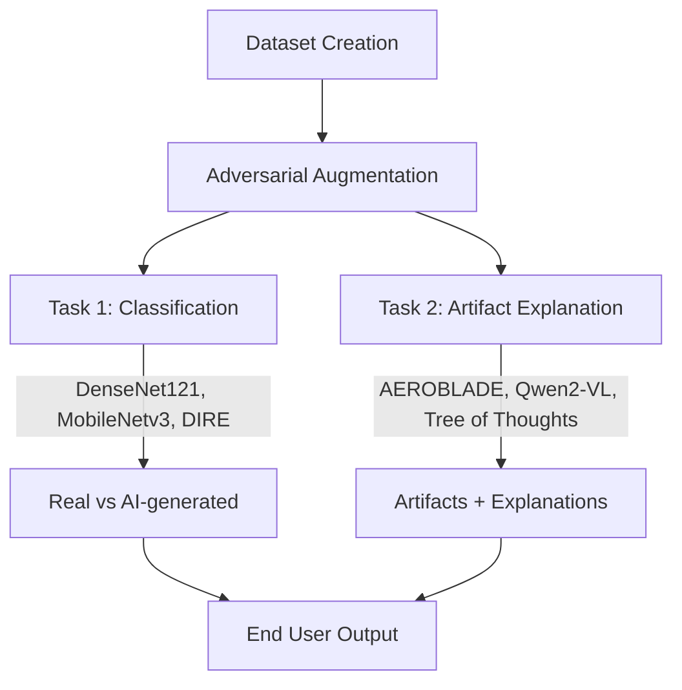
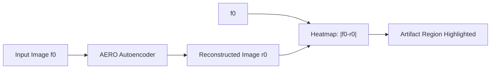
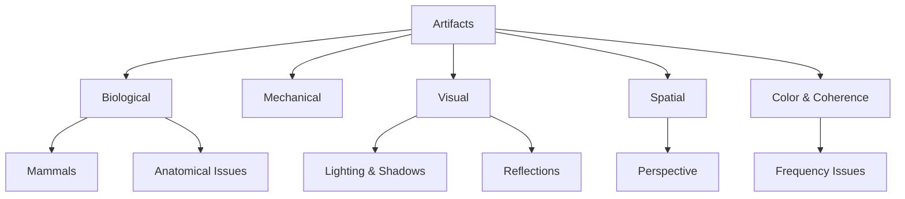

# Image Classification and Artifact Identification – IIT Bombay @ Inter IIT Tech Meet 13.0
## [Detailed Report by Bombay 76](https://drive.google.com/file/d/1l4eMijkaODRlSww4QJ4SM9Zjhl-yLii3/view?usp=sharing)
---

## Contents

1. [Problem Statement](#problem-statement)
2. [Background](#background)
3. [Solution Overview](#solution-overview)
4. [Product Design](#product-design)
5. [Data](#data)
6. [Methodology](#methodology)
   * [Ground Truths](#ground-truths)
   * [Models](#models)
   * [AEROBLADE for Artifact Localisation](#aeroblade-for-artifact-localisation)
   * [Fine-tuning with QLoRA](#finetuning-with-qlora)
   * [Tree of Thoughts (ToT) Taxonomy](#tree-of-thoughts-taxonomy)
   * [Taxonomy Tree](#taxonomy-tree)
7. [Experiments & Results](#experiments--results)
   * [Task 1: Classification](#task-1-classification)
   * [Task 2: Artifact Explanation](#task-2-artifact-explanation)
   * [Inference Times](#inference-times)
8. [Comparison with GPT-4o](#comparison-with-gpt-4o)
9. [Analysis of Test Dataset](#analysis-of-test-dataset)
10. [Additional Experiments](#additional-experiments)
11. [Discussion](#discussion)
    * [Limitations](#limitations)
    * [Implementation Difficulties](#implementation-difficulties)
    * [Potential Improvements](#potential-improvements)
    * [Applications](#applications)
12. [Appendix](#appendix)

---

## Problem Statement

The Adobe challenge at **Inter IIT Tech Meet 13.0** required solving a two-part problem:

1. **Binary Classification (Task 1):** Build a machine learning pipeline that can distinguish between *real* images and *AI-generated* images, even under adversarial perturbations and low resolutions.
2. **Artifact Explanation (Task 2):** Identify *why* an image is AI-generated by pointing out visible or hidden **artifacts** (like unrealistic textures, anatomical errors, geometry issues, etc.) to enhance interpretability and user trust.

This problem is critical in a world where **generative AI** tools like [Stable Diffusion](https://stability.ai/stable-diffusion), [DALL·E 3](https://openai.com/dall-e-3), [MidJourney](https://www.midjourney.com/home/), and [Adobe Firefly](https://www.adobe.com/sensei/generative-ai/firefly.html) are widely used for content creation.

---

## Background

* **Binary detection approaches** ([ResNet](https://arxiv.org/abs/1512.03385), [ViT](https://arxiv.org/abs/2010.11929)) achieve high accuracy but fail at *explainability*. They act as black boxes.
* **Artifact-driven detection**: [Zhang et al., 2019](https://arxiv.org/abs/1907.06515) studied GAN frequency artifacts; [Hou et al., 2023](https://arxiv.org/abs/2303.13808) showed these can be neutralized by adding adversarial noise.
* **Adversarial attacks** like [FGSM](https://arxiv.org/abs/1412.6572) and [PGD](https://arxiv.org/abs/1706.06083) highlight vulnerabilities in vision models. Defense mechanisms like [BoRT](https://openaccess.thecvf.com/content_CVPR_2019/html/Raff_Barrage_of_Random_Transforms_for_Adversarially_Robust_Defense_CVPR_2019_paper.html) are still experimental.
* Thus, **next-gen solutions** must:

  1. Handle **low-res noisy inputs**.
  2. Be robust to **adversarial perturbations**.
  3. Provide **artifact-level reasoning**.

---

## Solution Overview

This pipeline balances **speed, accuracy, robustness, and interpretability**.

---

## Product Design

* **Lightweight classification** → [MobileNetV3](https://arxiv.org/abs/1905.02244) and [DenseNet121](https://arxiv.org/abs/1608.06993) ensure efficient deployment on constrained hardware.
* **Artifact reasoning** → [Qwen2-VL](https://huggingface.co/Qwen/Qwen2-VL-2B) fine-tuned with [QLoRA](https://arxiv.org/abs/2305.14314), guided by [Tree of Thoughts](https://arxiv.org/abs/2305.10601).
* **Explainability** → [AEROBLADE](https://arxiv.org/abs/2401.10145) autoencoder reconstruction heatmaps highlight artifact locations.

---

## Data

* **CIFAKE** ([dataset](https://huggingface.co/datasets/cifake)): 120k images (50k real, 50k fake from Stable Diffusion v1.4).
* **PixArt-α** ([paper](https://github.com/PixArt-alpha/PixArt-alpha)): 1500 AI-generated images.
* **PixArt-Σ**: Advanced 4K diffusion transformer.
* **Adobe Firefly**: Proprietary generative AI.
* **GigaGAN** ([Kang et al. 2023](https://mingukkang.github.io/GigaGAN/)): Large-scale GAN-based text-to-image model.
* **DALL·E 3** ([OpenAI](https://openai.com/dall-e-3)).
* **Adversarial Augmentation**: [CleverHans](https://github.com/cleverhans-lab/cleverhans) used for FGSM and PGD.

Final **consolidated dataset** = CIFAKE + 5 AI sources + adversarial images.

---

## Methodology

### Ground Truths

* Low-res CIFAKE made manual annotation infeasible.
* Solution: Generate **ground truths** using [GPT-4o](https://openai.com) and [Claude-3 Sonnet](https://www.anthropic.com/claude).
* Intersection of GPT + Claude outputs ensured consistency. GPT-4o’s richer descriptions were preferred.

### Models

**Task 1 – Classification**

* [DenseNet121](https://arxiv.org/abs/1608.06993) → feature reuse, compact model.
* [MobileNetV3-small/large](https://arxiv.org/abs/1905.02244) → optimized for edge inference.
* [DIRE](https://arxiv.org/abs/2311.16480) → diffusion-specific anomaly detection.

**Task 2 – Artifact Explanation**

* [AEROBLADE](https://arxiv.org/abs/2401.10145): Autoencoder reconstruction error maps.
* [Qwen2-VL](https://huggingface.co/Qwen/Qwen2-VL-2B): Dynamic resolution multimodal transformer.
* [MoonDream2](https://huggingface.co/vikhyatk/moondream2): Optimized for on-device.

### AEROBLADE for Artifact Localisation

* Trained on **real CIFAR-10 images** → fails to reconstruct AI anomalies → high reconstruction error highlights artifacts.

### Finetuning with QLoRA

* [QLoRA](https://arxiv.org/abs/2305.14314) reduces fine-tuning cost by low-rank factorization + 4/8-bit quantization.
* Enables training billion-parameter models on commodity GPUs.

### Tree of Thoughts Taxonomy

* **39 categories, 70 artifacts** organized hierarchically.
* VLM traverses taxonomy step by step (DFS) → interpretable artifact explanations.

---

## Experiments & Results

### Task 1: Classification

* CIFAKE benchmark → DenseNet, MobileNet, DIRE all **>97% accuracy**.
* Consolidated dataset → **DenseNet121 = 98.65%**.
* With adversarial training → **98.96%**, robust to FGSM/PGD.

### Task 2: Artifact Explanation

* **Qwen2-VL + ToT** → **F1 = 0.79**, content similarity \~7.3.
* **MoonDream2** underperformed (F1 \~0.55).
* Adding **AEROBLADE heatmaps** improved MoonDream2 but degraded Qwen2.

### Inference Times

* MobileNetV3-small → 55ms/image (CPU).
* DenseNet121 → 165ms/image.
* Qwen2-VL → 1.88s/image.

---

## Comparison with GPT-4o

* On **downsampled Adobe Firefly images (32×32)**:

  * **Qwen2-VL:** F1 = 0.55 (better recall).
  * **GPT-4o:** F1 = 0.40 (better semantic explanation style).

---

## Analysis of Test Dataset

* Test set contained **unseen class (Fish)**.
* DenseNet121 → classified 280/300 as fake.
* Qwen2-VL + ToT explanations:

  * Over-smoothing of textures.
  * Unrealistic highlights.
  * Depth anomalies.
  * Blurred edges.

---

## Additional Experiments

* **Grad-CAM** ([paper](https://arxiv.org/abs/1610.02391)): Failed due to low resolution.
* **Iterative downsampling retraining**: Scale-invariance attempt, but reduced performance.
* **InternVL** ([Chen et al., 2024](https://arxiv.org/abs/2404.14958)): Failed with ToT.
* **Phi-3 Vision** ([Microsoft](https://huggingface.co/microsoft/phi-3-vision-128k-instruct)): Suboptimal.
* **LLaVA-1.5** ([LLaVA](https://llava-vl.github.io/)): Hallucinated artifacts.
* **CoOp** ([Zhou et al., 2021](https://arxiv.org/abs/2109.01134)): Poor thresholds, no explanations.
* **Barrage of Random Transforms (BoRT)**: Explored adversarial robustness.

---

## Discussion

### Limitations

* CNN classifiers = black boxes → misclassification explanations missing.
* Strong adversarial attacks still degrade performance.
* Dataset bias affects generalization.
* Qwen2-VL inference time (1.88s) → may be slow for real-time.

### Implementation Difficulties

* Annotating large datasets with ground-truth artifacts was costly.
* No reliable metric for artifact *content similarity* vs human judgment.

### Potential Improvements

* Use **transformer-based detectors** (e.g. EfficientViT).
* Knowledge distillation for real-time deployment.
* Stronger adversarial defenses beyond FGSM/PGD.

### Applications

* **Fake news verification** on social media.
* **Fraud detection** (forged IDs, doctored docs).
* **Medical imaging verification** (fraudulent X-rays, MRIs).

---

## Appendix

* **Clustering attempts:** t-SNE on MoonDream2 embeddings → no distinct artifact separation.
* **ToT theory:** Derived error bounds: expected FP ≤ Kβ, FN ≤ M(1−α).
* **Grad-CAM failure case:** Entire frog image masked, no fine localization.
* **Prompts used:** Detailed [Qwen2](#) and [ToT](#) prompts included in original report.
* **Alternative classifiers:** CoOp, BoRT, InternVL tested and discarded.

---
## Credits: IIT Bombay Contingent Members for Adobe- 
**Darshan Makwana | Saeel Nachane | Divyam Gupta | Aryan Bhosale | Shravya Suresh | Shivansh | Susmit Neogi | Shahu Patil  | Sravan K Suresh | Garima Gopalani | Saarthak Krishan**
