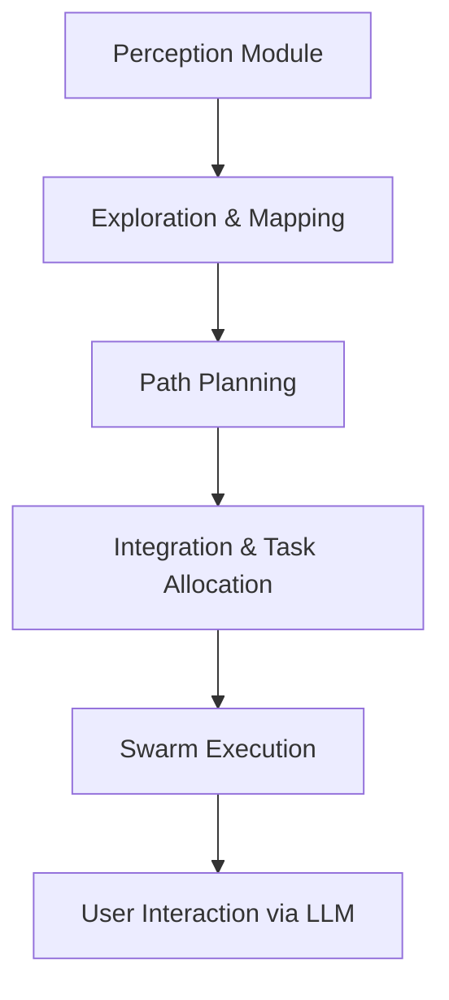
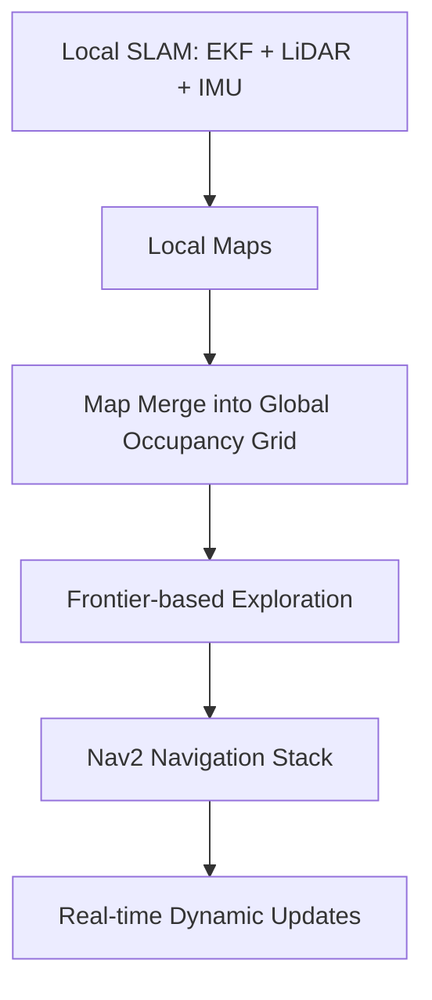
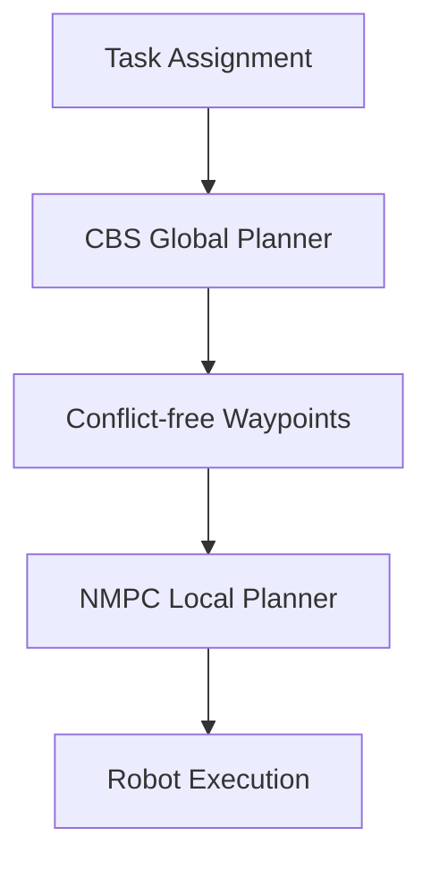

# BharatForge- Centralized Intelligence for Dynamic Swarm Navigation
## Source- [IIT Bombay's solution report for BharatForge](https://drive.google.com/file/d/1ujGXsq61Ln1Z371QqZmi4CARRK0bBB14/view?usp=sharing)
---

## Table of Contents
1. [Problem Statement](#problem-statement)
2. [Background](#background)
3. [Solution Overview](#solution-overview)
4. [System Architecture](#system-architecture)
   - [Perception](#perception)
   - [Exploration and Mapping](#exploration-and-mapping)
   - [Path Planning](#path-planning)
   - [Integration](#integration)
5. [Product Design](#product-design)
6. [Data](#data)
7. [Methods](#methods)
8. [Challenges](#challenges)
9. [Conclusion](#conclusion)
10. [Appendix](#appendix)
11. [References](#references)

---

## Problem Statement
The challenge is to enable **autonomous robotic swarms** to navigate and coordinate in **dynamic indoor environments** such as warehouses, where **GPS is unavailable**, and obstacles (static + dynamic) exist.  
The solution must provide:  
- **Collaborative SLAM**  
- **Real-time path planning**  
- **Dynamic obstacle handling**  
- **Task allocation**  
- **Natural language integration** for task execution  

---

## Background
- **Warehouse automation** is a critical challenge where multiple robots need to **map, localize, and plan paths** in real-time.  
- Traditional navigation techniques **fail in GPS-denied settings**.  
- Integration of **computer vision, SLAM, multi-agent path planning, and AI-driven task allocation** is essential.  
- Human–machine communication can be simplified using **Large Language Models (LLMs)**.  

---

## Solution Overview
We propose a **centralized control architecture (“brain”)** coordinating all robots.  

Key components:  
- **Perception** → YOLOv8 + Stereo cameras  
- **Mapping** → Multi-robot SLAM with EKF + Map Merging  
- **Planning** → Global CBS planner + Local NMPC controller  
- **Integration** → Task allocation, LLM-based command parsing  
- **Execution** → Real-time swarm operation in simulated warehouse  

---

## System Architecture

### Perception
- **Object Detection**: [YOLOv8](https://docs.ultralytics.com) (anchor-free CNN, real-time, trained on augmented warehouse dataset).  
- **Depth Estimation**: [Intel RealSense D435i](https://www.intelrealsense.com/beginners-guide-to-depth/).  
- **Robustness**: Objects added to database only if detected in ≥15 frames.  

**Metrics**: Achieved high mAP@0.5–0.95, confusion matrix confirms strong class separation.  

---

### Exploration and Mapping
- **SLAM Implementation**: Evaluated [RTAB-Map](https://introlab.github.io/rtabmap/) vs [SLAM Toolbox](https://github.com/SteveMacenski/slam_toolbox).  
  - Chose **SLAM Toolbox** → efficient 2D mapping, scalable, better for indoor multi-robot systems.  
- **Exploration**: [Explore Lite](https://wiki.ros.org/explore_lite) frontier-based exploration + [Nav2](https://navigation.ros.org/).  
- **Localization**: [AMCL](https://wiki.ros.org/amcl) particle filter for pose estimation.  
- **Dynamic Obstacle Detection**: LiDAR + DBSCAN clustering for static vs moving objects.  

---

### Path Planning
Two-layer planning system:  

1. **Global Planner** → [Conflict-Based Search (CBS)](https://www.aaai.org/ocs/index.php/AAAI/AAAI15/paper/view/10011)  
   - Resolves conflicts using **high-level conflict tree** + **low-level A***.  
   - Guarantees **optimal, conflict-free paths**.  

2. **Local Planner** → [Nonlinear Model Predictive Control (NMPC)](https://arxiv.org/abs/1703.01164)  
   - Generates smooth trajectories in real-time.  
   - Balances **tracking cost** vs **collision avoidance cost**.  

**Complexity Analysis**:  
- CBS: ~O(n) scaling with number of robots (until threshold).  
- NMPC: Linear scaling with horizon length.  

---

### Integration
- **Simulation Environments**: Small warehouse (15×17m) and large warehouse (31×52m).  
- **Robots**: Tugbot (differential drive, Velodyne VLP-16 LiDAR + RealSense D435i).  
- **Task Assignment**:  
  - Queue-based (efficient)  
  - Permutation-based (O(n!), not scalable)  
- **Idle Robots**: Assigned to mapping via complement-based centroid exploration.  
- **LLM Integration**: Hugging Face [Inference API](https://huggingface.co/inference-api) for natural language command parsing.  

---

## Product Design
- Modular framework: **Perception → Mapping → Planning → Execution**.  
- Extensible to larger warehouses and robot fleets.  
- Designed to balance **centralized coordination** + **local autonomy**.  

---

## Data
- **Training Dataset**: Generated from ROS bag frames → background removal → augmentation → realistic warehouse contexts.  
- **Object Classes**: Pallet, charging station, pallet jack, bins, fire extinguisher, etc.  
- **Sensor Data**: LiDAR scans, stereo depth, wheel odometry, IMU.  

---

## Methods

### SLAM Mathematical Model
- EKF-based fusion of LiDAR, IMU, wheel odometry.  
- Map merging via occupancy grid probability update:  

$$
P(m_{central}(x,y)=1) = 1 - \prod_{i=1}^{N} \left(1 - P(m_i(x',y')=1)\right)
$$

---

### NMPC Optimization
- Minimize tracking + collision costs:  

$$
J = \sum_{i=1}^N Q_{track} \, \|x_i - x_{ref,i}\|^2 + Q_{collision} \cdot \phi(x_i, obstacles)
$$

- Collision penalty function:  

$$
\phi(x, obstacles) = \frac{Q_{collision}}{1 + e^{\kappa(d-r)}}
$$

## Challenges
- Scalability of CBS in dense robot environments.  
- High computational load in **real-time SLAM** + path planning.  
- Simulation limits with **Gazebo** for large robot numbers.  
- Dynamic changes in map increase **time & space complexity**.  

---

## Conclusion
- Developed a **centralized swarm intelligence** system for warehouses.  
- Achieved **real-time SLAM, CBS planning, NMPC trajectory control**.  
- Validated scalability in **two warehouse environments**.  
- Integrated **LLM for natural language commands**, bridging human–robot interaction.  

---

## Appendix

### Alternatives Tried
- **SLAM**: RTAB-Map vs SLAM Toolbox → chose SLAM Toolbox (lightweight, scalable).  
- **Planners**: CBS vs ML/RL → CBS chosen for **determinism + traceability**.  
- **Task Assignment**: Queue-based vs Permutation-based → queue-based chosen for scalability.  

### Pseudocode References
- [CBS Algorithm (AAAI 2015)](https://ojs.aaai.org/index.php/AAAI/article/view/9253)  
- [NMPC Basics (Findeisen & Allgöwer, 2002)](https://folk.ntnu.no/skoge/prost/proceedings/ifac2002/data/content/04639/4639.pdf)  

---

## References
1. [RTAB-Map](https://introlab.github.io/rtabmap/) – Graph-based SLAM  
2. [SLAM Toolbox](https://github.com/SteveMacenski/slam_toolbox)  
3. [Explore Lite ROS](https://wiki.ros.org/explore_lite)  
4. [Nav2](https://navigation.ros.org/)  
5. [Conflict-Based Search (CBS)](https://ojs.aaai.org/index.php/AAAI/article/view/9253)  
6. [A* Search](https://en.wikipedia.org/wiki/A*_search_algorithm)  
7. [Nonlinear Model Predictive Control](https://arxiv.org/abs/1703.01164)  
8. [YOLOv8 Documentation](https://docs.ultralytics.com)  
9. [Intel RealSense Depth](https://www.intelrealsense.com/beginners-guide-to-depth/)  
10. [AMCL ROS](https://wiki.ros.org/amcl)  
11. [Hugging Face Inference API](https://huggingface.co/inference-api)  

---
## Credits- IIT Bommbay's Contingent team for BharatForge
**Annirudh | Deep Boliya | Tanmay Gejapati | Arin Weling | Dhruvi Modi | Vedant Bhardwaj | Pranav Rathi | Vishwaajith | Yash Sabale | Advay Bapat | Tushar Singha Roy | Daksh Sawke | Arjoe Basak | Sudhindra Sahoo | Madhav Agrawal | Aryan Kayande | Parth goel | Ayush Prasad**
