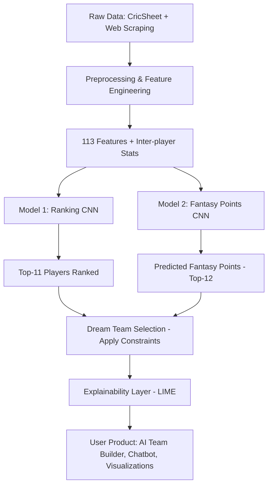

# Dream11- Next-Gen Team Builder with Predictive AI 
## [Detailed report by Bombay 76](https://drive.google.com/file/d/1MVW7rrWlRdkzesxn_TkiOh8rfM6fXDjb/view?usp=sharing)

---

## 1. Contents  
1. [Problem](#2-problem)  
2. [Background](#3-background)  
3. [Solution Overview](#4-solution-overview-flowchart-type)  
4. [Product Design](#5-product-design)  
5. [Data](#6-data)  
6. [Methods](#7-methods)  
7. [Challenges](#8-challenges)  
8. [Conclusion](#9-conclusion)  
9. [Appendix](#10-appendix)  

---

## 2. Problem  
Dream11 is India’s largest fantasy sports platform. The challenge is to **predict the Dream Team** (top 11 players who maximize fantasy points in a match) while addressing the following complexities:  

- **Accurate Player Predictions:** Player performance depends on form, opposition, venue, weather, and historical statistics.  
- **Team Constraints:** Budget caps, player roles (batsman, bowler, all-rounder), and minimum players per team.  
- **Dynamic Nature:** Player performance varies drastically across matches and formats (T20, ODI, Test).  
- **Explainability:** Predictions involve real money → models must not be black-boxes; users need transparent reasoning.  

---

## 3. Background  
- Dream11 assigns **fantasy points** based on real match statistics: runs, wickets, catches, strike rate, etc.  
- The **Dream Team** = top-11 fantasy point earners in a match.  
- Challenges in prediction:  
  - Uncertainty in performance due to match context.  
  - Dependencies across players (e.g., a bowler’s effectiveness vs certain batsmen).  
  - Optimizing team under **budget + composition** rules.  

**Prior Work:**  
- [Time-series](https://en.wikipedia.org/wiki/Time_series) methods (Dickey Fuller, [ARIMA](https://en.wikipedia.org/wiki/Autoregressive_integrated_moving_average)).  
- Machine learning (linear regression, decision trees).  
- [Deep learning](https://en.wikipedia.org/wiki/Deep_learning) (LSTMs for sequential data).  
- [Explainable AI](https://en.wikipedia.org/wiki/Explainable_artificial_intelligence) ([LIME](https://en.wikipedia.org/wiki/LIME_(Local_Interpretable_Model-agnostic_Explanations)), SHAP).  

Despite these, **predicting Dream Team composition** remained a multi-faceted problem → motivating a **dual-model [CNN](https://en.wikipedia.org/wiki/Convolutional_neural_network)-based approach**.  

---

## 4. Solution Overview (Flowchart Type)  

---

## 5. Product Design  

### A. User Research  
- Surveys & interviews across user segments (new/casual/seasoned players, cricket fans).  
- Findings:  
  - Users struggle with **data-driven decisions**.  
  - Process lacks **engagement**.  
  - High demand for **personalization + explainability**.  

### B. Design Philosophy  
- **Personalization:** AI-powered team builder adapting to user preferences.  
- **Simplicity:** Auto-fill, clean UI, intuitive stats.  
- **Gamification:** Chatbot assistant, cricket trivia, real-time news integration.  
- **Data-driven insights:** Dynamic graphs, comparative metrics.  

### C. Applications of GenAI  
1. **RAG-powered Chatbot (Ollama):**  
   - Player guidance, explaining rules, answering fantasy scoring queries.  
   - Handles natural language questions like: “Should I pick Bumrah against Australia?”  
2. **AI Team Builder:** Suggests optimal players considering recent form, roles, and team balance.  
3. **News Scraping + Llama 3.2 Summarizer:** Captures latest injury/team updates → summarized for users.  
4. **Dynamic Visualizations:** Player comparison charts, matchup histories.  
5. **Asynchronous Storage:** Saves team-building progress → resumes seamlessly later.  

---

## 6. Data  

### A. Acquisition  
- Source: **CricSheet** (ball-by-ball data).  
- Coverage: T20, ODI, Test → till Jan 2025.  
- Train set: till **June 2024**; Test set: **July–Nov 2024**.  
- Supplementary scraping for player roles (batsman, bowler, all-rounder).  

### B. Preprocessing  
- Converted JSON → CSV.  
- Missing values handled, features standardized.  
- Aggregated stats over **last 20 matches** (optimal window).  

### C. Features (113 total)  
- **Batting:** runs, strike rate, boundaries, 30+/50+/100 milestones, dismissal types.  
- **Bowling:** wickets, economy, maidens, extras (wides, no-balls).  
- **Fielding:** catches, stumpings, runouts (direct/indirect).  
- **Derived Metrics:** mean, std dev for consistency analysis.  
- **Inter-player Features:** e.g., “Left-arm spinner vs right-handed batsman strike rate.”  

---

## 7. Methods  

### A. Baseline Experiments  
- **[Regression](https://en.wikipedia.org/wiki/Linear_regression):** Predicted fantasy points individually. → Unstable due to order sensitivity.  
- **[MLP](https://en.wikipedia.org/wiki/Multilayer_perceptron) (Dense Net):** Predicted all 22 simultaneously → MAE ~25–26%. Black-box nature.  
- **[LSTM](https://en.wikipedia.org/wiki/Long_short-term_memory):** Sequential model (20 time steps × 41 features). → MAPE 35–50% → underperformed.  

### B. Transition to [CNN](https://en.wikipedia.org/wiki/Convolutional_neural_network)  
- Insight: Match input naturally forms a **2D grid** (players × features). CNNs can capture inter-player relations.  
- Players ordered by past performance; features grouped (batting, bowling, fielding) → [CNN](https://en.wikipedia.org/wiki/Convolutional_neural_network) learns local correlations.  

### C. Final Architecture – Dual [CNN](https://en.wikipedia.org/wiki/Convolutional_neural_network) Models  

**Input:** 22 players × 113 features (last 20 matches + inter-player stats).  

- **Ranking [CNN](https://en.wikipedia.org/wiki/Convolutional_neural_network)** → outputs Top-11 rankings.  
- **Fantasy Points [CNN](https://en.wikipedia.org/wiki/Convolutional_neural_network)** → outputs predicted scores of Top-12 players.  
- **Custom Loss:** Player-wise MAE + scaled fantasy point error.  
- **Output:** 11×1 vector → Dream Team (ensures min 1 player per side).  

**Performance:**  
- T20 → MAE 91, MAPE 13%.  
- ODI → MAE 240, MAPE 25%.  
- Test → MAE 254, MAPE 24%.  

### D. Explainability – [LIME](https://en.wikipedia.org/wiki/LIME_(Local_Interpretable_Model-agnostic_Explanations))  
- Explains feature influence per player (e.g., “strike rate vs off-spin bowlers contributed most”).  
- Tradeoff: High computation cost vs interpretability.  

---

## 8. Challenges  
1. **Data Discrepancies:** Player name mismatches (aliases, formatting) → custom matching required.  
2. **Data Volume:** Large JSON → slow parsing, optimized via custom scripts.  
3. **Accuracy vs Interpretability:** [CNN](https://en.wikipedia.org/wiki/Convolutional_neural_network) accurate but opaque → [LIME](https://en.wikipedia.org/wiki/LIME_(Local_Interpretable_Model-agnostic_Explanations)) mitigated but costly.  
4. **Open-source LLM Limitations:** Ollama chatbot → slower, less accurate vs paid APIs.  

---

## 9. Conclusion  
- The **dual [CNN](https://en.wikipedia.org/wiki/Convolutional_neural_network) architecture (Ranking + Fantasy Points)** clearly outperformed regression, MLPs, and LSTMs.  
- **20-match aggregation** gave best stability and accuracy.  
- [LIME](https://en.wikipedia.org/wiki/LIME_(Local_Interpretable_Model-agnostic_Explanations)) explainability increased user trust despite computation overhead.  
- Product integrates **prediction + personalization + GenAI tools** for an engaging fantasy experience.  

---

## 10. Appendix  

### A. Alternatives Tried  
- **AnchorTabular:** Rule-based explainability → too shallow.  
- **Counterfactuals:** Impractical for continuous cricket data.  

### B. Future Work  
- Merge the two CNNs into a **single multitask model**.  
- Extend to **other sports** on Dream11 (football, basketball, kabaddi).  
- Replace Ollama with **enterprise-grade LLM APIs** for better chatbot accuracy and continuity.  

---
