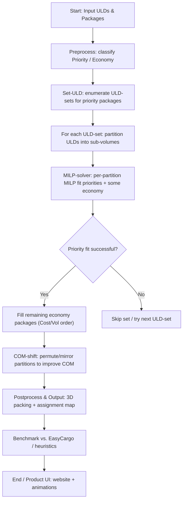
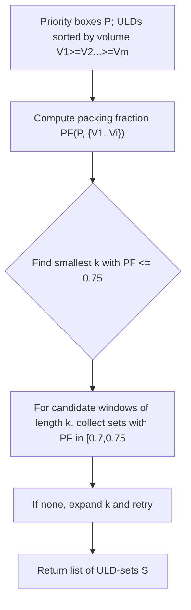
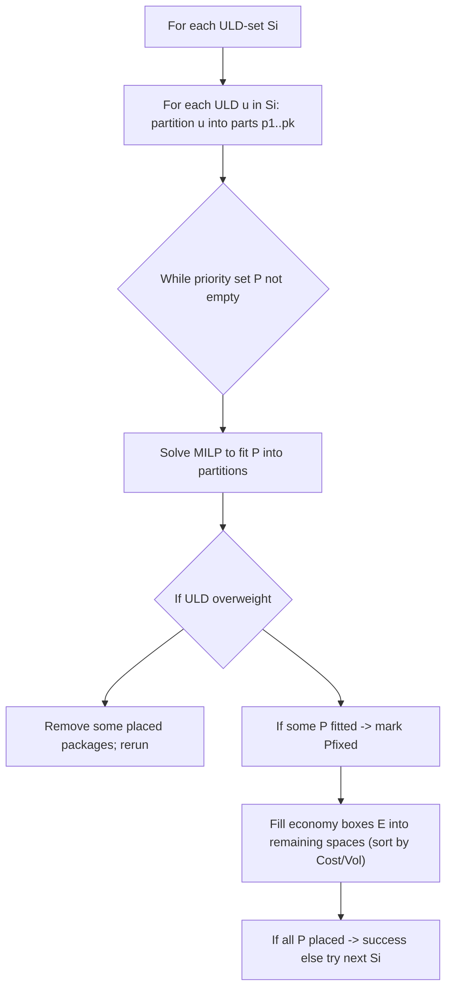
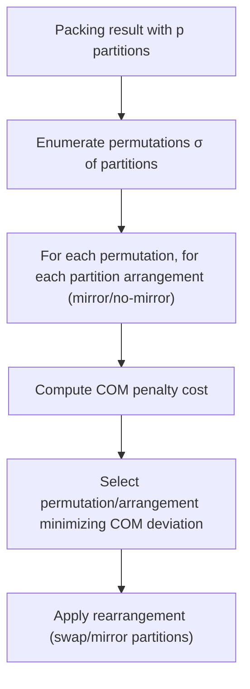

# FedEx- Optimizing ULDs for Air Cargo Packing 

## **Source:** [IIT Bombay Team Report for the FedEx ULD Optimization challenge](https://drive.google.com/file/d/1WlEQXi8_TIDJKbtozCBFWmcwzRMOajTi/view?usp=sharing).

---

# Contents
1. [Problem Summary](#problem-summary)  
2. [Background & Motivation](#background--motivation)  
3. [Solution Overview (high-level flow)](#solution-overview-high-level-flow)  
4. [Product Design & UX considerations](#product-design--ux-considerations)  
5. [Data & Input Formats](#data--input-formats)  
6. [Methods — approaches & MILP summary](#methods--approaches--milp-summary)  
7. [Algorithms (flowcharts + pseudocode)](#algorithms-flowcharts--pseudocode)  
8. [Results & Benchmarks](#results--benchmarks)  
9. [Challenges & Practical Considerations](#challenges--practical-considerations)  
10. [Conclusion & Business Impact](#conclusion--business-impact)  
11. [Appendix — Alternatives](#appendix--alternatives)  
12. [References & Links (one-click per unique resource)](#references--links)

> Quick navigation: use the table of contents anchors above. Many technical keywords are linked **once** to an external resource for deeper reading.

---

## Problem Summary

We are given:
- A set of **Unit Load Devices (ULDs)** `U1..Um`, each with dimensions `(L_j, B_j, H_j)`, weight limit `W_j`, and cost attributes.
- A set of **packages** `P1..Pn`, each with dimensions `(l_i, b_i, h_i)`, weight `w_i`, and a type: **Priority** (must be shipped) or **Economy** (can be dropped at a penalty cost `C_i`).

Objectives:
- Minimize total cost = (sum of penalties for dropped economy packages) + (cost proportional to number of ULDs used for priority packages) + stability/height penalties to encourage bottom-heavy packings.
- Hard constraints: no overlaps, packages fit inside assigned ULD, ULD weight limits, priority packages must be shipped.
- Practical desiderata: center-of-mass near ULD center, resistance to toppling, heavier boxes support lighter ones.

**Complexity:** 3D orthogonal packing with added weight & stability constraints — NP-hard. Best known approx results for 3D orthogonal knapsack: see Diedrich et al. (2007).

---

## Background & Motivation

- Air freight uses standardized ULDs; even modest improvements in packing fraction reduce cost per package and emissions.  
- The team’s approach blends **optimization** (MILP) with **heuristics** (partitioning, LAFF-like greedy, guillotine packing) and **post-processing** (COM-shift) to get practically feasible solutions in acceptable time.
- Real-world constraints beyond pure geometry (weight distribution, toppling, fragile padding) are modelled via linear constraints/penalties.

---

## Solution Overview (high-level flow)



---

## Product Design & UX considerations

Goal: make the solver **actionable for dispatch staff** (not just researchers).

Key product features:
- **CSV/JSON input** for package lists & ULD specs. Minimal required fields: `id, l,b,h,w,type,cost_of_delay`.
- **Run-time control**: user-settable MILP time limit per partition (practical tradeoff).
- **Visualization**: 3D rendering + per-item metadata (ID, weight) and partition boundaries for easy physical stacking at the dock.
- **Partition-guided build sheets**: partition-wise stack order that dispatchers can follow.
- **Safety overlays**: show COM, weight fractions, topple warnings.

---

## Data & Input Formats

**ULD CSV**
```
uld_id,L,B,H,W_max,openingside,shape
U1,159,119,81,1000,"front","rectangular"
```

**Packages CSV**
```
pkg_id,l,b,h,w,type,cost_of_delay
P001,30,20,10,5,Priority,0
P002,50,40,30,20,Economy,120
```

---

## Methods — approaches & MILP summary

### MILP (summary)
- **Binary assignment** `a_{i,j}`: package `i` assigned to ULD `j`.
- **Continuous coords** `x_i,y_i,z_i` in each ULD.
- **Orientation matrix** `O_i` (6 orientations per box).
- **Constraints:** non-overlap, weight limits, support, topple-stability.
- **Objective:** weighted sum = bottom-heavy + minimize dropped packages + minimize # ULDs with priorities + minimize tower heights.

---

## Algorithms (flowcharts & pseudocode)

### A. Set-ULD


### B. MILP-solver


### C. COM-shift


---

## Results & Benchmarks

- **Packing fraction achieved:** 78.09% (vs EasyCargo® 71.54%).  
- **Priority ULDs used:** 3 (vs 4 by EasyCargo®).  
- **Runtime:** ~25 min full pipeline (tunable).  
- **Observations:** COM-shift reduced deviations substantially.

---

## Challenges & Practical Considerations

1. Scalability of MILP.  
2. Numerical conditioning of big-M.  
3. Approximate topple modelling.  
4. Tradeoff between continuous/discrete.  
5. Fragile handling (padding).  
6. Solver choice/licensing.

---

## Conclusion & Business Impact

- Outperformed industrial tool benchmark.  
- Real fuel/emissions savings from packing efficiency.  
- Productization: modular MILP + dispatcher-facing UI.  

---

## Appendix — Alternatives

### Modified LAFF
- Surface-area greedy heuristic, bucketed by weight.  
- Pros: very fast. Cons: locally greedy.  

### Guillotine Packing
- Use 2D guillotine rectangle bin packer (Jylänki).  
- Stack upwards. Very fast (~30s). Suboptimal but stable.

---

## References & Links

- MILP/Integer programming: https://en.wikipedia.org/wiki/Integer_programming  
- Gurobi: https://www.gurobi.com/  
- Diedrich et al. (2007): https://link.springer.com/chapter/10.1007/978-3-540-71903-5_4  
- EasyCargo: https://www.easycargo3d.com/en/  
- RectangleBinPack (Jylänki): https://github.com/juj/RectangleBinPack  
- FedEx Packaging Guidelines: https://www.fedex.com/content/dam/fedex/us-united-states/services/GrlPkgGuidelines_fxcom.pdf  
- OR-Tools (alternative CP-SAT): https://developers.google.com/optimization  
- Carbon footprint note: https://consumerecology.com/carbon-footprint-of-package-shipping-transport/
 
- Carbon footprint note: https://consumerecology.com/carbon-footprint-of-package-shipping-transport/

## Credits: IIT Bombay Contingent Members for FedEx-
**Ayush Agarwal | Vaibhav Singh | Atharva C | Soham Joshi | Khushajh Verma | Dhriti Maniar | Siddhi Deshpande | Husain Batterywala | Aniket Gupta | Anand Narasimhan | Arnav Patel | Arnav | Kyari Ponkiya | Vishesh jain**
